# Software Requirements Specifications (SRS)
## TWS - Multi-Tenant Enterprise Resource Planning (ERP) Platform

**Document Version:** 2.9  
**Date:** March 3, 2026  
**Status:** Current System State Documentation

**⚠️ IMPORTANT NOTE:** This SRS describes **requirements** and **implementation state**. Implementation state is given as of the dates below; requirements added in v2.1 (February 24, 2026) may be **planned** rather than implemented — see per-requirement implementation notes and §9.1. **Currently active:** Software House ERP. **Future planned:** Business ERP, Warehouse ERP. **Not in scope:** Education, Healthcare, Retail, Manufacturing.

---

## 1. INTRODUCTION

### 1.1 Purpose

This Software Requirements Specification (SRS) document provides a comprehensive description of the TWS (The Wolf Stack) Multi-Tenant Enterprise Resource Planning (ERP) Platform as of March 2, 2026 (see §10 Document Control for version date). The document outlines functional and non-functional requirements, system architecture, use cases, and design constraints for a cloud-based SaaS platform that enables organizations from multiple industries to manage their business operations through a unified, multi-tenant ERP system.

The platform currently supports **Software House ERP** as the primary industry vertical, with infrastructure in place for future expansion to other industries. The system includes common ERP functionalities such as Human Resources, Finance, Projects, and Operations Management, along with specialized Software House features including Nucleus Project Management.

### 1.2 Scope

The TWS Multi-Tenant ERP Platform is designed to provide:

- **Multi-Tenancy Architecture**: Complete data isolation and independent configuration for each tenant organization
- **Software House ERP (Current Scope):** Fully implemented ERP system for software development companies with Nucleus PM, time tracking, client management (and Deal pipeline per FR29 when implemented), and development tools. Other ERP categories (Education, Healthcare, Retail, Manufacturing) are not in current scope.
- **Common ERP Modules**: Shared modules including HR Management, Finance, Project Management, Attendance, and Reporting
- **Platform Administration**: Supra Admin portal for managing tenants, subscriptions, and platform-wide operations
- **Tenant Administration**: Tenant Admin portal for managing organization-specific users, modules, and configurations
- **Role-Based Access Control**: Granular permissions system supporting multiple user roles across different industries
- **Default data on signup**: New tenants are seeded with default data (e.g. departments, chart of accounts) so they can use the product immediately
- **Real-Time Features**: WebSocket-based real-time updates for notifications and collaborative features
- **API Integration**: RESTful API for third-party integrations and mobile applications
- **Nucleus Project Management**: Advanced project management system for Software House ERP with client portal, deliverables, and approval workflows

**Out of Scope:**
- Mobile native applications (iOS/Android) — Web-based responsive design only. Mobile browser access (responsive web) is in scope; see §2.4 and NFR3.
- Payment gateway integration for tenant billing (handled externally)
- Advanced machine learning features
- Multi-language support (English only; deferred indefinitely — see NFR3)
- Offline functionality

### 1.3 Intended Audience

This document is intended for:
- **Software Developers**: To understand system requirements and implement features
- **Project Managers**: To plan development sprints and track progress
- **Quality Assurance Engineers**: To create test cases and validate requirements
- **System Architects**: To design system architecture and integration patterns
- **Stakeholders**: To understand system capabilities and limitations
- **Academic Supervisors**: To evaluate project scope and technical depth

### 1.4 Definitions, Acronyms & Abbreviations

| Term | Definition |
|------|------------|
| **TWS** | The Wolf Stack - Platform name |
| **ERP** | Enterprise Resource Planning |
| **SaaS** | Software as a Service |
| **Tenant** | An organization using the platform with isolated data and configuration |
| **Supra Admin** | Platform-level administrator with access to all tenants |
| **Tenant Admin/Owner** | Organization-level administrator managing their tenant |
| **Default data / seeding** | Data (or internal templates) used to seed new tenants with departments, chart of accounts, etc., at signup |
| **RBAC** | Role-Based Access Control |
| **JWT** | JSON Web Token - Authentication mechanism |
| **orgId** | Organization Identifier |
| **tenantId** | Tenant Identifier |
| **orgSlug** | URL-friendly tenant identifier |
| **MVC** | Model-View-Controller architecture pattern |
| **API** | Application Programming Interface |
| **REST** | Representational State Transfer |
| **WebSocket** | Real-time bidirectional communication protocol |
| **MongoDB** | NoSQL database used for data storage |
| **React** | Frontend JavaScript framework |
| **Express** | Backend Node.js web framework |
| **Nucleus** | Advanced project management system for Software House ERP |
| **TenantDepartmentAccess** | Tenant-scoped record granting a user access to a department (with optional expiry); managed by tenant admins (CEO, HR, Dept Head). **Department access is managed by tenant admins (CEO, HR Manager, Department Head) via TenantDepartmentAccess. SupraAdmin has no role in day-to-day department access management.** |
| **ProjectDepartmentConfig** | Per-department view and action config on a project (what each department can see/do: tasks, budget, deliverables, etc.) |
| **Tenant audit log** | Tenant-scoped audit trail (who accessed what, when) for CEO/Dept Head; separate from platform audit |
| **UPR** | Unified Permission Resolution — single source of truth for tenant ERP permissions (resolver, cache, GET /me/permissions, requireErpAccess middleware). See §7.7 and docs/UNIFIED_ACCESS_AND_ROLE_SYSTEM_PLAN.md. |
| **GDPR** | General Data Protection Regulation |
| **SOX** | Sarbanes-Oxley Act — actively applicable to finance module (FR13, FR21) |
| **FERPA** | Family Educational Rights and Privacy Act — future reference only; not applicable to Software House ERP. See §2.5 Regulatory Constraints. |
| **HIPAA** | Health Insurance Portability and Accountability Act — future reference only; not applicable to Software House ERP. See §2.5 Regulatory Constraints. |
| **PCI-DSS** | Payment Card Industry Data Security Standard — future reference only; payment gateway out of scope per FR20. See §2.5. |

---

## 2. OVERALL SYSTEM DESCRIPTION

### 2.1 Product Perspective

The TWS Multi-Tenant ERP Platform is a standalone, cloud-based SaaS application that operates independently without requiring integration with external ERP systems. The platform is designed to serve as a complete business management solution for organizations across multiple industries.

**System Context:**
- **Frontend**: React.js web application accessible via web browsers
- **Backend**: Node.js/Express.js RESTful API server
- **Database**: MongoDB with tenant-isolated data
- **Real-Time**: Socket.IO for WebSocket communication
- **File Storage**: Local file system or cloud storage (S3-compatible)
- **Email Service**: SMTP or third-party service (SendGrid, AWS SES)
- **Caching**: Redis (optional) for session management and performance
- **Monitoring:** Phase 1–2: Sentry (errors), Winston (logs), health check endpoints. Phase 3+: Prometheus + Grafana when platform has 50+ active tenants requiring SLA monitoring.

**External Dependencies:**
- MongoDB database cluster
- Email service provider (for notifications and welcome emails)
- Web browser (Chrome, Firefox, Edge, Safari)
- Internet connectivity

### 2.2 Product Functions

The TWS platform provides the following major functional areas:

1. **Platform Management (Supra Admin)**
   - Tenant creation, management, and monitoring
   - Default data seeding for new tenants at signup
   - Subscription plan management
   - Platform-wide analytics and reporting
   - User management across all tenants
   - System health monitoring

2. **Tenant Management (Tenant Admin)**
   - Organization configuration and settings
   - User management within tenant
   - Module activation and configuration
   - Branding and customization
   - Subscription and billing management (Software House tenants only; plan and usage limits apply; other ERP categories show plan N/A)
   - ERP category selection and module restrictions

3. **Software House ERP Module (Fully Implemented)**
   - **Nucleus Project Management**: Advanced workspace-based project management system with deliverables, Gantt charts, approval workflows, and change request management
   - **Time Tracking**: Billable hours tracking, project-wise time allocation, time reports
   - **Client Management**: Client profiles, project portfolios, communication history, invoice generation
   - **Development Tools**: Code quality tracking, development methodology (Agile, Scrum, Kanban), tech stack management
   - **Client Portal**: Read-only access for clients to view project progress, deliverables, and invoices. For Software House, the authoritative portal is tenant-scoped (e.g. `/api/tenant/:tenantSlug/...` or nucleus-client-portal); `/api/client-portal` is org/business-scoped. Software House clients use tenant-scoped portal only.
   - **Project Templates**: Pre-built templates for Web Development, Mobile App Development, API Development
   - **Analytics & Reporting**: Project analytics, team performance metrics, client reports, resource utilization
   - **Software House Roles**: Specialized roles for developers, project managers, and team leads
   - **Software House Attendance**: Industry-specific attendance tracking for development teams

4. **Software House ERP Modules** (Currently the only ERP category)
   - **HR Management**: Employee management, Payroll, Attendance, Departments, Teams, Leave management
   - **Finance**: Chart of accounts, Transactions, Invoicing, Financial reports, Budgeting, Tax management
   - **Projects**: Project templates, Task management, Project tracking, Resource allocation, Time tracking, Sprints, Teams
   - **Clients & Vendors**: Client management, Vendor management, Contact management, Partners
   - **Workspaces**: Nucleus Workspace as project container; Kanban/board view within Nucleus (see FR24/FR25)
   - **Documents (Document Hub)**: Document library, creation from templates, file upload, folders and tags, search and filtering, approval workflow, version history, export (HTML/Word/PDF), audit trail, bulk operations (see FR26)
   - **Reports & Analytics**: Customizable reports, Dashboards, Data export
   - **Notifications**: Real-time notifications, Email notifications, In-app notifications
   - **Nucleus Project Management**: Advanced workspace-based project management (see FR25)
   
   **Note**: These modules are currently Software House-specific. Infrastructure exists to make HR, Finance, and Projects "common" modules if other ERP categories (Education, Healthcare) are added in the future, where they would be restricted based on ERP category.

5. **Authentication & Authorization**
   - User registration and login
   - JWT-based authentication
   - Role-based access control
   - Session management
   - Tenant context management

6. **Data Management**
   - Tenant data isolation
   - Automatic data seeding on tenant creation
   - Data backup and recovery
   - Audit logging
   - GDPR compliance features

7. **Nucleus Project Management (Software House ERP)**
   - Workspace-based project management
   - Deliverable management with Gantt charts
   - Approval workflows
   - Change request management
   - Client portal with read-only access
   - Project templates and onboarding
   - Analytics and reporting
   - Batch operations

### 2.3 User Classes & Characteristics

| User Class | Characteristics | Typical Use Cases |
|------------|----------------|-------------------|
| **Supra Admin** | Platform administrator with full system access. Manages all tenants, subscriptions, and platform configuration. | Create/manage tenants, Monitor platform health, View platform analytics |
| **Tenant Admin/Owner** | Organization administrator managing their tenant. Has full control over tenant configuration, users, and modules. | Manage organization users, Configure modules, Customize branding, View tenant analytics, Manage subscriptions |
| **Manager** | Department or team manager with elevated permissions within their scope. | Manage team members, View reports, Approve requests, Assign tasks |
| **Employee** | Standard user with basic permissions. Access varies by industry and role. | View assigned tasks, Submit timesheets, Access personal information, View schedules |
| **Software House: Project Manager** | Software project manager managing software development projects. | Manage projects (Nucleus), Track development progress, Manage client relationships, Manage deliverables, Approve change requests, Monitor team performance |
| **Software House: Developer** | Software developer working on projects. | Log time, Update task status, Track deliverables, Update project progress, Submit deliverables for approval |
| **Software House: Team Lead** | Development team lead overseeing team members. | Manage team tasks, Review deliverables, Track team performance, Allocate resources |
| **Software House: Sales Executive / BD Manager** | Business development or sales. | Manage clients, Leads, Proposals, Client communication |
| **Software House: HR Manager / HR Executive** | Human resources. | Employee management, Payroll, Attendance, Leave, Department access |
| **Software House: Finance Manager / Accountant** | Finance and accounting. | Invoicing, Expenses, Reports, Budgeting |
| **Software House: QA Engineer** | Quality assurance. | Test deliverables, UAT, Bug tracking, Approval steps |
| **Software House: Designer** | Design role (UI/UX). | Design deliverables, Design review, Assets |
| **Software House: DevOps Engineer** | Infrastructure and deployment. | CI/CD, Environments, Monitoring (when in scope) |
| **External Auditor (temporary)** | Temporary access for audit. | Read-only audit log, Export (per role limits) |
| **Client (Read-Only)** | External client accessing project information. | View project progress (Gantt chart), View deliverables status, Create change requests, View invoices |

### 2.4 Operating Environment

**Server Environment:**
- **Operating System**: Linux (Ubuntu 20.04+), Windows Server, or macOS (development)
- **Node.js**: Version 18.x or higher
- **MongoDB**: Version 7.x or higher
- **Redis**: Version 6.0 or higher — **Required** for JWT revocation list (§7.5), session security. Optional for general caching/performance. Deployment without Redis means token revocation will not function (security risk).
- **Web Server**: Nginx or Apache (production)

**Client Environment:**
- **Web Browsers**: 
  - Google Chrome (latest 2 versions)
  - Mozilla Firefox (latest 2 versions)
  - Microsoft Edge (latest 2 versions)
  - Safari (latest 2 versions)
- **Operating Systems**:
  - Windows 10/11
  - macOS (latest 2 versions)
  - Linux (Ubuntu 20.04+)
  - Android 8.0+ (mobile browser)
  - iOS 13+ (mobile browser)
- **Screen Resolutions**: 
  - Desktop: 1920x1080 and above
  - Tablet: 768px - 1024px
  - Mobile: 320px - 767px
- **Network**: Internet connection with minimum 1 Mbps bandwidth

**Development Environment:**
- **IDE**: Visual Studio Code, WebStorm, or similar
- **Version Control**: Git
- **Package Managers**: npm (Node.js)
- **Testing Tools**: Jest, Supertest

### 2.5 Design & Implementation Constraints

**Technical Constraints:**
1. **Database**: Must use MongoDB for data storage (NoSQL document database)
2. **Backend Framework**: Must use Express.js (Node.js web framework)
3. **Frontend Framework**: Must use React.js (JavaScript UI library)
4. **Authentication**: Must use JWT (JSON Web Tokens) for stateless authentication
5. **API Design**: Must follow RESTful principles
6. **Code Structure**: Must follow MVC (Model-View-Controller) architecture pattern
7. **Multi-Tenancy**: Must implement tenant-isolated data model with tenantId/orgId filtering
8. **Real-Time Communication**: Must use Socket.IO for WebSocket connections

**Business Constraints:**
1. **Budget**: Limited to open-source technologies and free-tier cloud services (development)
2. **Timeline**: Must be completed within academic semester timeframe
3. **Team Size**: Single developer or small team (2-3 members)
4. **Deployment**: Must support cloud deployment (AWS, Azure, or similar)

**Regulatory Constraints:**
1. **Data Privacy**: Must comply with GDPR for EU users
2. **Education Data**: FERPA — future scope only (not applicable to Software House ERP)
3. **Healthcare Data**: HIPAA — future scope only (not applicable to Software House ERP)
4. **Financial Data**: Must comply with SOX for finance module
5. **Payment Data**: Payment gateway integration is out of scope (billing handled externally per FR20). If payment gateway is added in future, PCI-DSS compliance will be required; see Future Considerations appendix if needed.

**Performance Constraints:**
1. **Response Time**: API endpoints must respond within 500ms for standard operations
2. **Page Load**: Dashboard pages must load within 2-3 seconds
3. **Concurrent Users**: Minimum per tenant by plan — Trial/Starter: 25; Growth: 100; Professional: 500; Enterprise: unlimited
4. **Database Queries**: Must be optimized with proper indexing
5. **File Upload**: Maximum file size limit of 100MB per file

**Security Constraints:**
1. **Password Encryption**: Must use bcrypt with minimum 10 rounds
2. **Data Encryption**: Must use HTTPS/TLS for data in transit
3. **Input Validation**: All user inputs must be validated and sanitized
4. **SQL Injection Prevention**: Must use parameterized queries (Mongoose)
5. **XSS Prevention**: Must sanitize all user-generated content
6. **CSRF Protection**: Must implement CSRF tokens for state-changing operations
7. **Rate Limiting**: Must implement rate limiting for authentication endpoints (5 attempts per 15 minutes)
8. **Tenant Isolation**: Must enforce tenant data isolation at middleware level

---

## 3. FUNCTIONAL REQUIREMENTS

**Numbering note:** FR7–FR11, FR15, and FR28 are reserved/deprecated; no requirements are assigned to these numbers in this version.

### 3.1 Role mapping: TenantUser ↔ Software House job roles

Permission enforcement uses the role–permission matrix (see FR27 and docs/ROLE_PERMISSION_MATRIX.md or Plan §5). The following mapping relates `TenantUser.primaryRole` to Software House job roles used in that matrix:

| TenantUser.primaryRole | Maps to SH job role(s) | Notes |
|------------------------|------------------------|--------|
| owner | CEO/Director | Full access |
| admin | Department Head | Dept-scoped |
| manager | Team Lead | Team-scoped |
| project_manager | Project Manager | Project-scoped |
| hr | HR Manager, HR Executive, or Payroll Officer (via hrSubRole) | See requirement below |
| employee | Senior/Junior Dev, Designer, QA, etc. | Dept determines sub-role |
| client | Client | Client portal only |
| contractor | Contractor | Time-bound |

**HR sub-role (mandatory):** For `TenantUser.primaryRole = 'hr'`, the system SHALL use a required field **`hrSubRole`**: `'manager' | 'executive' | 'payroll_officer'`. **HR Manager** (`hrSubRole: 'manager'`): Full HRM including salary edit, terminations, attendance, leave. **HR Executive** (`hrSubRole: 'executive'`): Attendance, leave, onboarding; NO payroll, NO salary edit. **Payroll Officer** (`hrSubRole: 'payroll_officer'`): Payroll only; NO other HR data. **Enforcement:** requireErpAccess (or equivalent) middleware SHALL check both primaryRole and hrSubRole for HR/payroll routes so that payroll data access is not granted to HR Executive.

| No | Requirement Title | Description |
|---|---|---|
| **FR1** | **Multi-Tenant Architecture** | The system must support multiple independent tenant organizations, each with:<br>• Isolated data using tenantId/orgId filtering<br>• Unique subdomain/slug access (`<tenant-slug>.domain.com`)<br>• Independent configuration and settings<br>• Isolated user management<br>• Tenant-specific branding (logo, colors, company name)<br>• Resource quotas based on subscription plan<br>• ERP category selection (currently: Software House; infrastructure for Business and Warehouse exists but not fully implemented)<br><br>**FR1 compliance (verified and updated):**<br>• **tenantId/orgId filtering** — Implemented; queries and verifyERPToken use orgId/tenantId consistently.<br>• **Unique slug access** — Implemented; tenant resolution by slug and token verification in place.<br>• **Independent configuration** — Implemented; per-tenant `/config` GET/PUT and settings.<br>• **Isolated user management** — **Implemented (per-tenant role):** Access control now uses **per-tenant role** when available. `verifyERPToken` loads `TenantUser` for the current user+tenant; if an active TenantUser exists, `req.user.role` is set from `TenantUser.primaryRole` (so the same user can have different roles in different tenants). If no TenantUser exists, fallback to `User.role` for backward compatibility. Self-serve signup creates a `TenantUser` for the owner; invited users get TenantUser via tenant switching/invite flow. TenantUser roles include: owner, admin, manager, project_manager, hr, employee, client, contractor. **Department access is tenant-admin only; see FR27 and §1.4 TenantDepartmentAccess.**<br>• **Tenant-specific branding** — Partially implemented; tenant config can store logo/company name; frontend uses `tenant.logoUrl`/`tenant.logo` and theme colors in layout (TenantOrgLayout, SoftwareHouseTopNavbar).<br>• **Resource quotas by subscription** — Implemented: Quotas are enforced on the operations listed in FR20 (tenant user create/invite, project create/restore, workspace create, client create, document/file upload) via featureGate/usage middleware on the corresponding tenant routes. Effective limit = plan limit + add-ons.<br>• **ERP category** — Software House implemented; Business and Warehouse infrastructure exists but not fully implemented (known gap). |
| **FR2** | **Tenant Provisioning & Onboarding** | **⚠️ SELF-SERVE SIGNUP ONLY — Supra Admin Cannot Create Tenants**<br><br>The system provides automated tenant creation through self-serve signup only, with tenant workspaces accessible via **path-based routing** on a shared subdomain: **app.nexaerp.com/&lt;tenant-slug&gt;**<br><br>**Tenant access & routing**<br>• Each tenant gets a unique slug selected during signup.<br>• Tenant workspace is accessible at **app.nexaerp.com/&lt;tenant-slug&gt;**<br>• Slug must be unique across the platform, URL-safe, and validated at API level with a clear error (not a raw DB exception).<br>• **Slug is immutable after creation** (changing it would break bookmarked URLs and integrations); API rejects slug change with `400 SLUG_IMMUTABLE`.<br>• Future migration path to **&lt;tenant-slug&gt;.nexaerp.com** is preserved — no architectural changes required, only routing layer update.<br><br>**Signup flow (3 steps)**<br>• **Step 1** — User registers with email, password, and full name.<br>• **Step 2** — 6-digit OTP email verification (required before tenant creation proceeds).<br>• **Step 3** — User enters organisation name and selects slug; system validates uniqueness in real time before submission (live API: `GET /api/signup/check-slug-availability` with debounced input).<br><br>**What the system creates automatically on signup**<br>• Tenant record with `erpCategory: 'software_house'`<br>• Default organisation linked to tenant<br>• First user set as owner (`User.role = 'owner'`) with orgId assignment and TenantUser record<br>• Default data seeded: departments, teams, chart of accounts, sample projects<br>• Welcome email sent to tenant owner<br>• Onboarding progress tracker initialised<br><br>**Supra Admin capabilities**<br>• ❌ Cannot create tenants (all routes disabled by design).<br>• ✅ Can view, update, suspend, and delete existing tenants.<br>• **Rationale:** Enforces verified ownership from day one; admin-created tenants would bypass OTP verification and onboarding tracking.<br><br>**Known gaps / future work**<br>• Enterprise white-glove provisioning path for direct sales (Supra Admin creates tenant with forced email verification step).<br>• **Onboarding (v2.1):** Steps: (1) Email verified (auto on signup), (2) Organization created (auto on signup), (3) Profile completed (name, phone, timezone), (4) First department created or confirmed, (5) First team member invited, (6) First project created, (7) Explore Nucleus PM (first workspace opened). Completion: All steps done OR 30 days passed (auto-dismissed). Display: Progress bar in dashboard, dismissible after Step 2. |
| **FR3** | **User Authentication & Authorization** | The system must provide secure authentication and authorization:<br>• User registration with email and password<br>• User login with JWT token generation<br>• Role-based access control (RBAC) with multiple roles: Supra Admin, Tenant Admin/Owner, Manager, Employee, and Software House roles (see §2.3 User Classes).<br>• Session management with refresh tokens<br>• Password reset functionality<br>• Account activation and deactivation<br>• Rate limiting for authentication endpoints |
| **FR4** | **Default Data on Tenant Signup** | When a new tenant is created via self-serve signup (FR2), the system must seed that tenant with sensible default data (e.g. departments, teams, chart of accounts, sample structure) so the tenant can use the product immediately. Seeding may use internal template or fixed default data; no Supra Admin UI or public API for creating or managing such templates is required. **For tenants with department-based access (Software House):** seeding must create default TenantDepartmentAccess records so the owner/CEO has access to all seeded departments. No tenant user should be blocked from their own default departments on first login. |
| **FR5** | **Supra Admin Portal** | The system must provide a **Supra Admin portal** (platform administration) for users with platform-admin roles, accessible after Supra Admin login. The portal must include:<br>• **Dashboard**: Platform overview, total tenants, subscription plan distribution (Software House only), tenant growth trends, and key platform metrics.<br>• **Tenant management**: List, view, update, suspend, and delete existing tenants. Supra Admin cannot create tenants (tenant creation is self-serve only per FR2). For Software House tenants, Supra Admin can assign or change subscription plan (trial, starter, growth, professional, enterprise). For non–Software House tenants, plan is shown as N/A and plan selection is disabled.<br>• **Billing**: Billing overview filtered by Software House tenants; create and manage invoices; mark invoices as paid/failed (payment collection is external). Plan distribution and revenue-related metrics are Software House only.<br>• **Platform user management**: Manage platform-level users (Supra Admin roles and permissions); assign or revoke Supra Admin portal access; platform RBAC (e.g. billing read, invoices, tenants, users, system).<br>• **System & health**: System health checks, monitoring endpoints, and operational visibility (e.g. health status, metrics).<br>• **Access control**: Platform permissions and roles (e.g. platform_super_admin, platform_admin, platform_billing) so that access to tenant data, billing, and system functions is permission-gated.<br>Access to the Supra Admin portal and all its APIs must be restricted to authenticated users with the appropriate platform role; tenant users must not access Supra Admin routes. |
| **FR6** | **Software House ERP Module** | The system must provide software house-specific functionality (backend and Nucleus frontend implemented — see §9.1):<br>• **Nucleus Project Management System**:<br>  - Workspace-based project organization<br>  - Deliverable management with Gantt chart visualization<br>  - Sequential approval workflow for deliverables<br>  - Change request management<br>  - Client portal with read-only access to deliverables<br>  - Project templates (Web Development, Mobile App, API Development)<br>  - Onboarding checklist and progress tracking<br>  - Analytics and reporting (workspace stats, project summaries, at-risk tracking)<br>  - Batch operations for bulk updates<br>  - Auto-calculation of project progress<br>  - Date validation and dependency management<br>• **Time Tracking**: Billable hours tracking, project-wise time allocation, time reports, billing integration<br>• **Client Management**: Client profiles, project portfolios, communication history, invoice generation<br>• **Development Tools**: Code quality tracking, development methodology (Agile, Scrum, Kanban), tech stack management<br>• **Software House Roles**: Specialized roles for developers, project managers, team leads<br>• **Software House Attendance**: Industry-specific attendance tracking for development teams<br>• **Technology Stack Management**: Frontend, backend, database, cloud platforms, development tools<br>• **Billing Configuration**: Hourly rates, billing cycles, invoice templates<br>• **Team Configuration**: Max team size, remote work policies<br>• All common modules available (HR, Finance, Projects)<br>• **Department Management & Access**: Tenant-level department CRUD; tenant-admin grant/revoke of department access with optional expiry; role–permission matrix; project list and single-project view filtered by user’s departments and per-department view config (ProjectDepartmentConfig); tenant-facing audit log; 7-step API security middleware for protected endpoints |
| **FR12** | **HR Module (Software House ERP)** | **⚠️ NOTE: Currently only available for Software House ERP. Would become "common" if other ERP categories are added.**<br><br>**Employee offboarding (mandatory process):** (1) HR initiates offboarding for employee. (2) System presents checklist: (a) Reassign open tasks (required before access revoke), (b) Transfer document ownership, (c) Confirm equipment return (manual checkbox), (d) Set last working date. (3) On last working date: TenantUser.status → inactive; all active sessions invalidated; TenantDepartmentAccess records → revoked. (4) Emergency offboarding: HR/CEO can trigger immediate revoke; access suspended immediately. **Task reassignment:** For each open task owned by the terminated employee: (a) Find the task's project → that project's PM; (b) If PM exists assign to PM, else Department Head, else tenant owner; (c) Tag task "Needs Handover Review." Multi-project: each task is reassigned to that project's PM independently. If the terminated employee is Team Lead: flag department "Team Lead vacancy"; notify Department Head and CEO; reassign their tasks to PM (do not auto-elevate another to Team Lead). Tasks flagged "Needs Handover Review." (5) Audit: All steps logged in TenantAuditLog. (6) Data retention: Time logs and project history retained (read-only); PII archived per GDPR after configurable days.<br><br>The system provides human resources functionality for Software House tenants:<br>• Employee management (profiles, departments, positions, hire dates, salaries)<br>• Payroll management (pay frequencies, tax settings, deductions, calculations)<br>• Attendance management (check-in/check-out, policies, overtime, remote work)<br>• Department management (budgets, heads, descriptions)<br>• Team management (leads, members, assignments)<br>• Leave management (requests, approvals, balances)<br>• Multiple attendance systems (modern, simple, calendar-based, software house specific)<br><br>**Current Status**: These are Software House ERP modules, not truly "common" since only one ERP category exists. Infrastructure exists to make these common modules if other ERP categories (Education, Healthcare) are added in the future. |
| **FR13** | **Finance Module (Software House ERP)** | **⚠️ NOTE: Currently only available for Software House ERP. Would become "common" if other ERP categories are added.**<br><br>The system provides financial management functionality for Software House tenants:<br>• Chart of accounts (hierarchical account structure, codes, types)<br>• Transaction management (revenue, expenses, categories, dates)<br>• Invoicing (generation, sending, tracking)<br>• Financial reporting (income statements, balance sheets, cash flow)<br>• Budgeting (planning, tracking, variance analysis)<br>• Tax management (rates, calculations, compliance)<br><br><br>**Current Status**: This is a Software House ERP module, not truly "common" since only one ERP category exists. Infrastructure exists to make this a common module if other ERP categories are added. |
| **FR14** | **Projects Module (Software House ERP)** | **⚠️ NOTE: Currently only available for Software House ERP. Would become "common" if other ERP categories are added.**<br><br>The system provides project management functionality for Software House tenants:<br>• Project templates (phases, durations, default settings)<br>• Project creation and management (name, description, budget, timeline)<br>• Task management (assignments, priorities, statuses, due dates)<br>• Project tracking (progress, hours, costs)<br>• Resource allocation (team members, equipment)<br>• Time tracking (logged hours, billable/non-billable)<br>• Sprint management (Agile/Scrum)<br>• Team management<br>• Development metrics tracking<br><br>**Current Implementation State**: Backend is substantial: general projects API (`/api/projects`), tenant organization projects API (`/api/tenant/:slug/organization/projects`), manager cockpit, templates, milestones/upcoming, and project members are implemented. Frontend is partially wired: tenant project UI uses tenant API; some project pages (cockpit, overview, templates) use the general projects API. Sprint creation, approval/change-request model refs, and PM notifications have been aligned with ProjectMember owner lookup and Deliverable refs. |
| **FR16** | **Dashboard & Analytics** | The system must provide role-specific dashboards:<br>• **Supra Admin Dashboard**: Platform overview, total tenants, subscription distribution, tenant growth trends<br>• **Tenant Admin Dashboard**: Organization overview, user statistics, module usage<br>• **Software House Dashboard**:<br>  - Project status overview (Nucleus workspaces)<br>  - Team performance metrics<br>  - Client metrics and project portfolios<br>  - Time tracking summary<br>  - Deliverable status and approvals<br>  - At-risk projects tracking<br>• Real-time metrics and KPIs<br>• Interactive charts and visualizations |
| **FR17** | **Reporting & Export** | The system must provide reporting capabilities:<br>• **Supra Admin Reports**: Tenant usage, Revenue reports, Platform statistics<br>• **Tenant Admin Reports**: User activity, Module usage, Financial reports<br>• **Software House Reports**:<br>  - Project reports (Nucleus workspace analytics)<br>  - Time tracking reports (billable hours, project allocation)<br>  - Client reports (project portfolios, invoices)<br>  - Team performance reports<br>  - Deliverable status reports<br>  - Change request reports<br>• Export to PDF, Excel, CSV formats<br>• Customizable date ranges and filters |
| **FR18** | **Notifications** | The system must provide notification features:<br>• Real-time notifications via WebSocket (Socket.IO)<br>• Email notifications<br>• In-app notifications<br>• Notification preferences (user-configurable): email on/off, in-app on/off, per event type where supported<br>• Notification templates for different events<br>• WhatsApp (or SMS) is optional/future; not assumed in scope unless explicitly enabled<br>• **Notification trigger matrix (authoritative):**<br>Task assigned — In-app ✅, Email ✅ — Assignee, PM<br>Leave approved — In-app ✅, Email ✅ — Employee, HR<br>Leave rejected — In-app ✅, Email ✅ — Employee<br>Invoice overdue — In-app ✅, Email ✅ — Finance, PM<br>Deliverable rejected — In-app ✅, Email ✅ — Assignee<br>Budget 80% warning — In-app ✅, Email ✅ — PM, Finance, CEO<br>Project delayed — In-app ✅, Email ✅ — PM, Dept Head<br>Critical bug — In-app ✅, Email ✅ — QA Lead, Dev Lead, PM<br>Salary processed — In-app ✅, Email ❌ (sensitive) — Employee<br>Dept access granted — In-app ✅, Email ✅ — Employee<br>Dept access revoked — In-app ✅, Email ✅ — Employee, HR<br>Emergency offboard — In-app ✅, Email ✅ — HR, Dept Head, CEO<br>• **Real-time (Socket.IO) scope:** Rooms: Each client joins `tenant:{tenantId}:user:{userId}`; org-wide events use `tenant:{tenantId}`. No cross-tenant room access. Missed notifications: Stored (e.g. tenant_notifications); delivered on reconnect for unread (e.g. last 24 hours). |
| **FR19** | **File Management** | The system must support file uploads and management:<br>• File upload for various purposes (documents, images, videos, PDFs)<br>• File validation (type, size limits - max 100MB)<br>• Secure file storage with access control<br>• File organization (folders, categories)<br>• File sharing and permissions<br>• AWS S3 integration support |
| **FR20** | **Subscription & Billing Management** | **Scope:** Billing and subscription plans apply to **Software House ERP tenants only**. Other ERP categories are not billed; plan is shown as N/A and limits are not enforced.<br><br>The system must manage tenant subscriptions as follows:<br>• **Plans:** Five subscription plans — Trial, Starter, Growth, Professional, Enterprise. Storage limits: 2 GB / 5 GB / 10 GB / Custom for Starter / Growth / Professional / Enterprise. Plans are seeded via script and referenced by slug.<br>• **Plan limits (authoritative):** The following limits are authoritative; seed script and SubscriptionPlan MUST match. Trial = Starter limits. Starter — Users 20, Projects 5, Workspaces 5, Clients 10, Storage 5 GB; Growth — Users 50, Projects 15, Workspaces 15, Clients 25, Storage 10 GB; Professional — Users 200, Projects 50, Workspaces 50, Clients 100, Storage custom; Enterprise — unlimited, Storage custom.<br>• **Trial:** New Software House tenants receive a 7-day free trial (Starter limits). Trial plan and trial period are configurable.<br>• **Trial expiry:** On trial expiry, tenant enters read-only mode immediately (same behaviour as payment-failed after grace period). Trial tenants may export their data before expiry via the standard export/reporting features. **Trial → paid upgrade (user cap):** If current user count exceeds the selected plan limit, the system SHALL block upgrade until user count is within limit. System SHALL show: "You have X users, plan limit is Y. Deactivate Z users or choose a higher plan." Tenant admin SHALL select which users to deactivate (or choose a higher plan). Only after user count is within limit (or higher plan selected) SHALL upgrade complete.<br>• **Suspension flow (read-only mode) — warning timing by type:** **Payment failed (7-day grace expires):** Day 7: in-app + email warning "Account will enter read-only in 24 hours." Day 8: 5-minute warning to active sessions; then read-only. **Trial expiry:** Day 6: warning email to owner "Trial expires in 24 hours." At expiry: 5-minute warning to active sessions; then read-only. **Supra Admin manual suspension:** Immediate; no 5-minute warning. Active sessions see "Account suspended. Contact support." Log manual suspension by Supra Admin. After read-only: write operations return 403; read allowed; active WebSocket connections remain open for read; read-only banner in UI. On next login after suspension: redirect to billing page.<br>• **Storage enforcement:** **Storage quota measurement (authoritative):** INCLUDED: uploaded files (S3), Document Hub files, profile pictures and attachments. EXCLUDED: MongoDB document data, tenant_audit_logs, system thumbnails/previews. Measurement: total bytes under tenant S3 prefix; updated on every upload/delete; reported in GET /api/billing/usage → storageUsed (bytes). At 100%: uploads and document creation blocked; existing data read-only until upgrade or cleanup. 80% warning: shown to tenant owner and billing admins via billing/usage API and UI.<br>• **Subscription status:** Active, Suspended, Cancelled, Past Due, Trialing. Status is tracked per tenant.<br>• **Billing cycle:** Monthly, Quarterly, Yearly. Supra Admin can create and manage invoices; payment gateway integration is out of scope (handled externally).<br>• **Usage limits (Software House only):** Enforced per plan for users, projects, workspaces, client accounts, and storage. Limits are enforced on: tenant user create/invite, project create/restore, workspace create, client create, and document/file upload. Active project count is used for project limit. Effective limit = plan limit + add-ons (see below). **Enforcement is implemented** on the operations listed above (see FR1).<br>• **Add-ons:** Tenants may have add-ons (extra users, extra storage in GB, extra workspaces). Effective limit for each metric = base plan limit + add-on quantity. Storage add-on is converted from GB to bytes for enforcement.<br>• **80% usage warning:** When any metric reaches ≥ 80% of its limit, the system returns an at-risk indicator. Tenant-facing billing/usage API and UI show an upgrade CTA (banner or prompt) when at-risk; creation is not blocked until 100%.<br>• **Grace period and read-only mode:** When a payment is marked failed, the tenant’s subscription records paymentFailedAt. After 7 days, a scheduled job sets the tenant to read-only mode (no writes; reads allowed). Write operations (create/update/delete) for Software House tenants in read-only mode return 403 with a clear message. When the invoice is marked paid, paymentFailedAt is cleared and read-only mode is turned off.<br>• **Feature gating by plan:** Plan feature flags (e.g. payroll, customRoles, reportsAdvanced, hrAdvanced) are enforced for Software House tenants on the corresponding routes (e.g. payroll routes, custom roles routes). Tenants on plans without the feature receive a 403 with an upgrade message; non–Software House tenants are not gated by these flags.<br>• **Supra Admin billing:** Billing overview, plan distribution, and tenant-based revenue metrics filter by erpCategory === 'software_house'. Tenant management shows plan N/A and disables plan selection for non–Software House tenants. Only Software House tenants can be assigned starter/growth/professional/enterprise plans.<br>• **Tenant-facing API:** GET /api/billing/usage returns current usage, limits, plan, atRisk, atRiskMetrics, readOnlyMode, and features for the authenticated user’s tenant (resolved via organization). Used by the frontend for usage display and upgrade prompts.<br>• **Subscription upgrade/downgrade:** Supported via API and Supra Admin; plan change is restricted to Software House tenants as above. |
| **FR21** | **Audit Logging** | The system must log all critical actions:<br>• User actions (creation, modification, deletion)<br>• Data access and modifications<br>• Login attempts and authentication events<br>• Permission changes<br>• Export operations<br>• Audit logs include: User ID, Timestamp, Action, Entity Type, IP Address, User Agent<br>• Audit logs are searchable and exportable<br><br>**Platform vs tenant audit:**<br>• **Platform audit (SupraAdmin only):** Login/logout, tenant creation/suspension, platform role changes, cross-tenant operations.<br>• **Tenant audit (CEO/Dept Head):** Module access (payroll, finance, HR), resource changes (task updates, approvals), department access grants/revokes, data exports, permission changes within tenant.<br>• **Login events:** Platform audit only; tenant audit may optionally log "user accessed tenant" from token use. Tenant audit does not duplicate raw login/logout — CEO sees "who did what" within tenant, not platform login details.<br>• **Retention:** Default: tenant audit log 1 year; platform audit log 2 years. Maximum retention configurable (e.g. 7 years for SOX-relevant financial audit). On expiry: archive (recommended for compliance). **Archive definition:** After retention period, move to cold storage (e.g. S3 Glacier or separate MongoDB collection with TTL disabled). Archived logs: read-only, not deleted. Access: Supra Admin (platform audit); Tenant owner + Supra Admin (tenant audit). Retrieval: Supra Admin can restore archived logs to active within 7 days of archival. SOX financial audit: retain 7 years; no auto-delete after archive period. Who can change: tenant admin (tenant audit); Supra Admin (platform). SOX: financial audit logs 7-year retention when finance module is in scope. |
| **FR22** | **API & Integration** | The system must provide API endpoints:<br>• RESTful API for all modules<br>• API authentication using JWT tokens<br>• Rate limiting and API versioning<br>• Webhook support for external integrations<br>• Calendar integration (Google Calendar): optional / Phase 4; not a core FR for Software House ERP.<br>• Swagger/OpenAPI documentation |
| **FR23** | **Profile Management** | The system must allow users to manage their profiles:<br>• Update personal information (name, email, phone, address)<br>• Upload profile picture<br>• Change password with validation<br>• Configure preferences (theme, language, timezone, notifications)<br>• View activity history |
| **FR24** | **Workspace Management** | The system must provide workspace management for project collaboration:<br>• **Nucleus Workspace** as the container for projects (workspace-based organization). Kanban view within Nucleus for development teams; board/card/list management are sub-features of Nucleus (FR25), not separate standalone modules.<br>• Template management<br>• **Workspace guest role:** Guest = client-facing access for that workspace; can view only what the client access layer allows (e.g. project progress, approved deliverables, invoices, UAT as per Plan §7). Restrictions: no internal tasks, team list, or other clients; no elevation to member for internal data. Guest is client-only (internal users with guest on a workspace have the same view restrictions). See Plan §7 for client CAN/CANNOT see.<br>• **API enforcement:** PATCH/PUT workspace member role endpoint SHALL reject elevation of a user who has TenantUser.role = 'client' to member, admin, or owner. Return 403 with message "Client users cannot be given internal workspace access." Check at API level, not only UI. |
| **FR25** | **Nucleus Project Management** | The system must provide advanced project management for Software House ERP:<br>• Workspace-based project organization<br>• Deliverable management with Gantt chart visualization<br>• Sequential approval workflow<br>• Change request management<br>• Client portal with read-only access to deliverables<br>• Project templates (Web Development, Mobile App, API Development)<br>• Onboarding checklist and progress tracking<br>• Analytics and reporting (workspace stats, project summaries, at-risk tracking)<br>• Batch operations for bulk updates<br>• Auto-calculation of project progress<br>• Date validation and dependency management<br>• **Deliverable rejection path:** On reject, deliverable returns to In progress/Revision; assignee notified; may revise and resubmit; rejector can add comment; PM can cancel with audit.<br>• **Change request approval authority (per tenant policy):** Minor (&lt; 2 h): Team Lead; Medium (2–8 h, same budget): PM; Major (budget impact): PM + CFO; Scope (timeline impact): PM + CEO.<br>• **Change request edge cases:** Tech Lead on leave → approval escalates to PM (or configurable delegate). PM is requester → cannot self-approve; escalates to Department Head. No CFO in tenant → major budget changes escalate to CEO. Client requests scope change → client creates change request; PM evaluates tier; appropriate authority approves; client cannot approve their own change request. Rejection: returned to requester with reason; may be revised and resubmitted (like deliverable). **Max resubmissions:** Default 3 (configurable per tenant, range 1–10). When max reached: deliverable/change request locked; status "Escalated"; auto-notify PM + Department Head. PM can override (allow more submissions) or cancel with reason. Tenant config: Settings → Project → "Maximum resubmission attempts" (default 3).<br><br>**Current Implementation State**: Nucleus backend is complete: `/api/nucleus-pm` (from erp/software-house) provides deliverables, approvals, change requests, and PM notifications via ProjectMember owner lookup. Workspace approval step enforcement uses `approvalRole` (dev_lead, qa_lead, security, client) on workspace members. **Client portal (Software House):** Authoritative for Software House is the tenant-scoped client portal (e.g. `/api/tenant/:tenantSlug/...` client-portal or `/api/nucleus-client-portal`). `/api/client-portal` is org/business-scoped; Software House clients must use the tenant-scoped portal only. Tenant Software House exposes client-portal config and projects. Nucleus frontend is implemented: deliverables (list/detail, create/edit, approval progress), approval queue (pending list, approve/reject), change requests (dashboard, detail, acknowledge/evaluate/accept/reject), and analytics (at-risk deliverables, status summary, project filter). Routes: `projects/deliverables`, `projects/approvals`, `projects/change-requests`, `projects/analytics`. Overall status: backend and frontend complete; see §9.1 Module Availability. |
| **FR27** | **Department Management & Access (Software House ERP)** | The system must provide department management and access control for Software House tenants:<br>• **Department CRUD**: Tenant admins can create, read, update, and delete departments (hierarchy, department head, settings). APIs: `GET/POST/PUT/DELETE /api/tenant/:tenantSlug/departments`; department dashboard/overview with statistics.<br>• **Tenant-admin department access**: CEO, HR, or Department Head (tenant admins) can grant, revoke, or suspend a user’s access to specific departments, with optional expiry (e.g. for contractors or external auditors). Implemented via TenantDepartmentAccess model and APIs: `GET/POST/PUT /api/tenant/:tenantSlug/department-access`, `POST /:id/revoke`, `POST /:id/suspend`, `GET /me` for current user’s departments. No dependency on Supra Admin for day-to-day assignment.<br>• **User’s departments**: A service returns the list of department IDs the user has active access to (from TenantDepartmentAccess). Used to filter project list and project metrics so users only see projects whose primary department or departments array intersects their allowed departments when the tenant uses department-based visibility.<br>• **Multi-department project view (ProjectDepartmentConfig)**: Projects may have multiple departments (primaryDepartmentId, departments[]). Per-department view and action config (viewConfig: e.g. canSeeTasks, canSeeBudget, canSeeDeliverables; actionConfig: e.g. canCreateTasks, canLogTime) so that the same project is presented differently to Dev, QA, Finance, or Sales. Single-project API applies this config when returning project data so Finance sees budget-only view when config exists. **Preset application:** When a department is added to a project, the PM SHALL manually select a preset by roleInProject (dev, design, qa, pm, finance_observer, sales_observer) per Plan §8.2 at add time. No auto-assignment by department type. Preset is editable after creation. Config applies per department.<br>• **Role–permission matrix**: A defined matrix (see docs/ROLE_PERMISSION_MATRIX.md and plan §5) covers modules (Projects, Tasks, Design, Attendance, Leave, Payroll, CRM, Clients, Finance, HR, Reports, Notifications, Settings, Audit) and roles (CEO, Department Head, Tech Lead, Senior/Junior Dev, HR Manager/Executive/Payroll Officer, CFO/Senior/Junior Accountant, Contractor, Client, External Auditor). Reports and notifications (who can generate/view/export; who gets in-app/email/WhatsApp) are specified. Enforcement uses a 7-step API security middleware where applicable.<br>• **API security middleware (7-step pattern)**: Every protected API should (1) verify tenant context, (2) verify user is active, (3) verify department access when resource is department-scoped, (4) verify role permission, (5) verify project membership when resource is project-scoped, (6) log to tenant audit when the operation is sensitive, (7) return 403 with a generic message (no information disclosure). **Implemented as requireErpAccess(options)** and used on: department-access, audit, payroll, finance, attendance (all variants including tenant org `/hr/attendance` and admin attendance panel), employees, teams, tenant org `/hr/employees`, and integration finance. See §7.7 Unified Permission Resolution (UPR).<br>• **Tenant audit log**: Tenant-scoped audit events (userId, action, resourceType, resourceId, departmentId, timestamp, IP, metadata). API: `GET /api/tenant/:tenantSlug/audit` with filters (user, date range, resource type). Access restricted to CEO, owner, admin, department lead. UI: Audit log page with filters and CSV export.<br>• **UI**: Departments list, create, edit, and department dashboard; “Manage Access” under Departments for granting/revoking department access with optional expiry; Audit log page under tenant org menu. |
| **FR26** | **Documents Module (Document Hub)** | The system must provide a document management module (Document Hub) for Software House ERP:<br>• **Document Library**: Unified view of created documents and uploaded files; grid, list, and table view modes; pagination; real-time updates<br>• **Document Creation**: Create documents from templates (Blank, Proposal, Contract, Meeting Notes, Project Brief, SOW, Invoice Cover) or blank; rich text editor (BlockNote-based) with auto-save, manual save, and keyboard shortcuts<br>• **File Upload**: Upload PDF, Word, Excel, PowerPoint, images, TXT, ZIP, RAR; upload progress; cloud storage (S3); uploaded files view/download only<br>• **Organization**: Folders and tags for grouping; folder sidebar navigation; tag filtering and assignment; "All Documents" view<br>• **Search & Filtering**: Full-text search; filters for status (Draft, In Review, Approved, Archived), type (created vs uploaded), folder, tags; sort by last updated, created date, title; filter persistence in URL<br>• **Document Lifecycle & Approval**: States (Draft, In Review, Approved, Archived); submit for review; approval queue for reviewers; approve/reject with comments; status badges<br>• **Version History**: Track versions on save; view and restore previous versions; version drawer in editor<br>• **Export & Download**: Export as HTML, Word (.docx), PDF; download uploaded files; safe filenames<br>• **Audit Trail**: Activity log for viewed, created, edited, submitted, approved, rejected, archived, restored, deleted; timestamp, user, document, comments; dedicated audit page with pagination and filtering<br>• **Bulk Operations**: Multi-select documents; bulk delete; selection counter and clear selection<br>• **Metadata**: Title, type, status, created/updated dates, created by, folder, tags, template; displayed on cards/list items<br><br>**Access control (document access by role):** Create: All employees in assigned department. Submit (for review): Creator only. Approve: Department Head or Senior role in that department. Delete: Creator (Draft only) or Admin/Department Head (any state). Bulk delete: Admin, Department Head only. Export: Creator, Department Head, CEO. View: All users in same department; CEO/Admin see all departments. Documents are department-scoped when tenant uses department-based visibility (FR27); document list filtered by user's departments. Contractor/client access follows role–permission matrix (e.g. no upload to client projects unless explicitly allowed).<br><br>**Document approval notifications and review timeout:** On submit for review: notify Department Head + Senior roles in document's department (in-app + email). Message: "[User] submitted [Doc name] for review." On approve: notify creator. On reject: notify creator with reason/comment. **Review timeout:** After 7 days without action, re-notify reviewers. After 14 days, escalate to Department Head. No auto-approve; human decision required. |
| **FR29** | **CRM / Deal Management (Software House ERP)** | **Deal entity:** name, clientId, value, status, assignedSalesPersonId, expectedCloseDate, lostReason (required when status = lost).<br>**Deal statuses:** lead → qualified → proposal_sent → negotiation → won | lost.<br>**Access:** Sales Executive: own deals (CRUD). Sales Manager: all deals (CRUD + approve proposals). PM: read-only deal summary. Finance: won deals only (budget reference). CEO: full pipeline view.<br>**Won flow:** Mark Won → System creates Project in Nucleus: Project.name = Deal.name, Project.clientId = Deal.clientId, Project.budgetPlaceholder = Deal.value, Project.dealId = Deal._id. Notify all project_manager users + Finance. Notifications sent AFTER project created. On failure: deal stays 'won'; create FailedHandoff alert to CEO/admin; admin can retry project creation from deal.<br>**Lost flow:** lostReason mandatory before archiving; lost deals archived (read-only).<br>**API:** `/api/tenant/:tenantSlug/deals`. Collection: `deals` (§9.4). |
---

## 4. NON-FUNCTIONAL REQUIREMENTS

| No | Requirement | Description |
|---|---|---|
| **NFR1** | **Performance** | • System should load dashboard pages within 2-3 seconds<br>• API endpoints should respond within 500ms for standard operations<br>• Database queries should be optimized with proper indexing<br>• Minimum concurrent users per tenant by plan: Trial/Starter 25, Growth 100, Professional 500, Enterprise unlimited. Concurrent user limits assume horizontal scaling for Professional/Enterprise; single instance capacity and scaling trigger points may be defined in deployment/ops documentation.<br>• File uploads should support files up to 100MB per file<br>• Real-time updates should have latency less than 100ms |
| **NFR2** | **Security** | • Passwords must be encrypted using bcrypt (minimum 10 rounds)<br>• JWT tokens must have expiration and refresh token mechanism<br>• System must prevent SQL Injection (using parameterized queries with Mongoose)<br>• System must prevent XSS (Cross-Site Scripting) attacks<br>• System must prevent CSRF (Cross-Site Request Forgery) attacks<br>• Data encryption at rest and in transit (HTTPS/TLS)<br>• Role-based access control (RBAC) enforcement at API and UI levels<br>• Session management with automatic logout after inactivity<br>• Input validation and sanitization for all user inputs<br>• Tenant data isolation to prevent cross-tenant data access<br>• Rate limiting for authentication endpoints (5 attempts per 15 minutes)<br>• Rate limiting for general API endpoints (100 requests per 15 minutes)<br>• TLS verification required for data in transit. HIPAA-specific verification applies when Healthcare module is added (future scope). |
| **NFR3** | **Usability** | • Interface must be user-friendly and intuitive<br>• Responsive design for Desktop (1920x1080+), Tablet (768px-1024px), Mobile (320px-767px)<br>• Consistent UI/UX across all modules<br>• **Accessibility:** Current: basic accessibility (keyboard navigation, readable contrast, meaningful error messages). WCAG 2.1 Level AA required only if product is sold to government or EU enterprise clients.<br>• **Language:** English only for v1.0 and v2.x. Multi-language support deferred indefinitely unless entering Arabic/French market.<br>• Clear error messages and validation feedback<br>• Loading indicators for long-running operations<br>• **Mobile browser restrictions (REDIRECT only, no read-only):** Payroll, full financial reports, tenant audit log, and bulk export are desktop-only. Mobile browser SHALL NOT show data for these modules; REDIRECT only. Backend checks X-Client-Platform (or equivalent); if 'mobile' and route is restricted: return 403 with body { message: "Available on desktop only", code: "DESKTOP_ONLY" }. Frontend shows friendly "Desktop only" page. Bulk export from mobile: BLOCKED (403). |
| **NFR4** | **Reliability & Availability** | • System must maintain 99.5% uptime<br>• Automatic failover for critical services<br>• Graceful error handling with user-friendly error messages<br>• System should be available 24/7 with scheduled maintenance windows<br>• Health check endpoints for monitoring<br>• Transaction rollback on errors to maintain data consistency<br>• **Maintenance windows:** Max length 4 hours per window. Maintenance excluded from 99.5% SLA. Minimum notice to tenants 48 hours. Active sessions: read-only during window or sessions invalidated with message (per implementation). Schedule considers Pakistan + client time zones (e.g. USA, UK, UAE). |
| **NFR5** | **Scalability** | • System should support horizontal scaling<br>• Should handle 10x growth in tenants, users, and data without major refactoring<br>• **Current phase:** Single MongoDB instance with proper indexing (tenantId, orgId, departmentId). **Sharding:** Future when platform exceeds 1000 concurrent users or 500GB data.<br>• Load balancing for API servers<br>• Caching strategy (Redis) for frequently accessed data<br>• Stateless API design for easy scaling |
| **NFR6** | **Maintainability** | • Code should follow MVC architecture pattern<br>• Modular code structure with clear separation of concerns<br>• Comprehensive code documentation (JSDoc)<br>• Version control using Git<br>• Easy to update and extend modules independently<br>• Unit tests and integration tests coverage (minimum 70%)<br>• Consistent coding standards and linting |
| **NFR7** | **Data Backup & Recovery** | • System should perform automated daily backups<br>• Backup retention: 30 days daily, 12 months monthly<br>• Point-in-time recovery capability<br>• **RTO (Recovery Time Objective):** Development/early stage: RTO &lt; 24 hours. Growth stage (10+ paying tenants): RTO &lt; 8 hours. Enterprise stage: RTO &lt; 4 hours.<br>• **Data replication:** Single-region deployment with daily backups sufficient for current phase. Multi-data-center replication: Production Phase 2 / when platform exceeds 50 active tenants.<br>• Backup verification and testing procedures |
| **NFR8** | **Compatibility** | • Should work with all major browsers (Chrome, Firefox, Edge, Safari - latest 2 versions)<br>• Cross-platform support (Windows 10/11, macOS, Linux, Android 8.0+, iOS 13+)<br>• Backward compatibility with API versions<br>• Graceful degradation for unsupported browsers |

---

## 5. SYSTEM ARCHITECTURE

### 5.1 Technical Stack

**Frontend:**
- **Framework:** React 18.x
- **State Management:** React Context API
- **Routing:** React Router v6
- **UI Components:** Ant Design, Mantine, Custom components
- **Styling:** CSS3, Tailwind CSS
- **Forms:** React Hook Form
- **API Client:** Axios
- **Real-time:** Socket.IO Client
- **Charts:** Chart.js, Recharts

**Backend:**
- **Runtime:** Node.js 18.x
- **Framework:** Express.js 4.x
- **Database:** MongoDB 7.x with Mongoose ORM
- **Authentication:** JWT (JSON Web Tokens), Passport.js
- **Real-time:** Socket.IO
- **File Upload:** Multer, Multer-S3
- **Validation:** Express Validator, Joi
- **Email:** Nodemailer, SendGrid
- **Security:** Helmet, Express Mongo Sanitize, Express Rate Limit
- **Logging:** Winston
- **Task Queue:** BullMQ
- **Caching:** Redis (optional)
- **Monitoring:** Phase 1–2: Sentry, Winston, health check endpoints. Phase 3+: Prometheus + Grafana when 50+ active tenants.
- **API Documentation:** Swagger/OpenAPI

**Infrastructure:**
- **Cloud Storage:** AWS S3
- **Deployment:** Docker, PM2
- **Web Server:** Nginx

### 5.2 Multi-Tenant Architecture

**Tenant Isolation Mechanism:**

The system implements tenant isolation using:
- **Tenant Identification**: Each tenant has a unique `tenantId` and `orgSlug`
- **Data Filtering**: All database queries automatically filter by `tenantId` and `orgId`
- **Middleware Enforcement**: Tenant middleware enforces tenant context on all requests

**Database Strategy:**

- **Shared Database**: Single MongoDB database with tenant-isolated collections
- **Tenant Filtering**: All collections include `tenantId` and `orgId` fields
- **Query Filtering**: Queries automatically filtered by tenant context
- **Indexing**: Proper indexes on tenantId and orgId for performance

### 5.3 Module Architecture

**Backend Module Structure:**

```
modules/
├── auth/          # Authentication & Authorization
├── admin/         # Supra Admin & Platform Management
├── tenant/        # Tenant Management & Organization Routes
├── core/           # Core Services (Health, Metrics, Files, Notifications)
├── business/       # Business Logic (HR, Finance, Projects, etc.)
├── monitoring/     # System Monitoring
└── integration/    # External Integrations
```

**Industry-Specific ERP Routes:**

- **Software House (active):** `modules/business/erp/software-house/` and `modules/tenant/erp/software-house/`

**Inactive / Legacy (NOT IN USE):**
- **Education**: `modules/tenant/erp/education/`
- **Healthcare**: `modules/tenant/erp/healthcare/`

### 5.4 API Architecture

**RESTful API Design:**
- **Base URL**: `/api`
- **Authentication**: JWT tokens in Authorization header or cookies
- **Versioning**: API versioning support
- **Rate Limiting**: Per-endpoint rate limiting
- **Error Handling**: Standardized error responses

**Key API Endpoints:**

- `/api/auth/*` - Authentication
- `/api/users/*` - User management
- `/api/supra-admin/*` - Supra Admin operations
- `/api/tenant/*` - Tenant management
- `/api/employees/*` - Employee management
- `/api/attendance/*` - Attendance management
- `/api/payroll/*` - Payroll management
- `/api/finance/*` - Finance management
- `/api/projects/*` - Project management
- `/api/clients/*` - Client management
- `/api/notifications/*` - Notifications
- `/api/files/*` - File management
- `/api/documents/*` - Document Hub (documents, folders, tags, approval, audit)

**Authoritative API paths (Software House):** For tenant-scoped Software House ERP, use the following base paths. Org-scoped or legacy paths (e.g. `/api/client-portal`, `/api/nucleus-pm`) are not the authoritative tenant-scoped paths for Software House.

| Module | Authoritative path |
|--------|---------------------|
| Nucleus PM | `/api/tenant/:tenantSlug/nucleus-pm` |
| Workspaces | `/api/tenant/:tenantSlug/workspaces` |
| Departments | `/api/tenant/:tenantSlug/departments` |
| Department Access | `/api/tenant/:tenantSlug/department-access` |
| Client Portal | `/api/tenant/:tenantSlug/client-portal` |
| Audit Log | `/api/tenant/:tenantSlug/audit` |
| HR Employees | `/api/tenant/:tenantSlug/employees` |
| Attendance | `/api/tenant/:tenantSlug/attendance` |
| Leave | `/api/tenant/:tenantSlug/leave` |
| Payroll | `/api/tenant/:tenantSlug/payroll` |
| Finance | `/api/tenant/:tenantSlug/finance` |
| Projects | `/api/tenant/:tenantSlug/projects` |
| Tasks | `/api/tenant/:tenantSlug/tasks` |
| Time Tracking | `/api/tenant/:tenantSlug/time-entries` |
| CRM/Clients | `/api/tenant/:tenantSlug/clients` |
| Deals (FR29) | `/api/tenant/:tenantSlug/deals` |
| Documents | `/api/tenant/:tenantSlug/documents` |
| Notifications | `/api/tenant/:tenantSlug/notifications` |
| Reports | `/api/tenant/:tenantSlug/reports` |

---

## 6. USE CASE SPECIFICATIONS

### 6.0 Use Case – Functional Requirement Mapping and Scope Alignment

This subsection maps each use case to the functional requirements it satisfies and identifies gaps. All use cases are **in scope** for the TWS Multi-Tenant ERP Platform (Software House ERP); none are out of scope.

**Mapping table (all use cases):**

| Use Case | Primary FR(s) | Secondary / Related FRs | Alignment notes |
|----------|----------------|--------------------------|------------------|
| **UC-01** Tenant Registration & Provisioning | FR2, FR4 | FR1 (tenant creation), FR3 (registration) | ✅ Fully aligned. Covers self-serve signup, OTP, slug, default data seeding, TenantDepartmentAccess for owner. Supra Admin cannot create tenants (per FR2). |
| **UC-02** User Authentication & Login | FR3 | FR1 (tenant context), §7.5 JWT | ✅ Fully aligned. Covers login types, JWT, TenantUser/role, departmentIds, platform, rate limiting, audit. |
| **UC-03** Software House Module Access | FR6, FR12–FR14, FR16 | FR27 (menu by department/role) | ✅ Aligned. Module visibility by role/department; Nucleus, HR, Finance, Projects, Time Tracking, Clients. Does not replace UC-04/UC-05 for detailed flows. |
| **UC-04** Nucleus Project Management | FR6, FR24, FR25 | FR14 (projects), FR18 (notifications) | ✅ Fully aligned. Workspace, deliverables, approvals, change requests, client portal, ProjectDepartmentConfig presets, approval authority by tier. |
| **UC-05** Department Management & Access | FR27 | FR6 (dept CRUD), FR21 (tenant audit) | ✅ Fully aligned. Department CRUD, grant/revoke/suspend, expiry, bulk grant, revocation list, audit. |
| **UC-06** Supra Admin Operations | FR5 | FR20 (billing), FR21 (platform audit) | ✅ Covers platform dashboard, tenant mgmt, billing, platform users, system health. |
| **UC-07** Dashboard & Analytics | FR16 | — | ✅ Role-specific dashboards (Supra, Tenant Admin, Software House). |
| **UC-08** Reporting & Export | FR17 | FR21 (audit of exports) | ✅ Reports and export (PDF, Excel, CSV); rate limits and desktop-only where applicable. |
| **UC-09** Notifications | FR18 | — | ✅ In-app, email, trigger matrix, preferences, Socket.IO, missed delivery. |
| **UC-10** File Management | FR19 | FR20 (storage quota), FR26 (Document Hub) | ✅ Upload, organize, share; 100MB limit; S3; quota. |
| **UC-11** Subscription & Billing | FR20 | FR5 (Supra Admin billing) | ✅ Tenant usage/upgrade; Supra Admin plans/invoices; read-only and trial expiry. |
| **UC-12** Tenant Audit Log Access | FR21 | FR27 (access control) | ✅ View and export tenant audit; CEO/Dept Head; desktop-only export. |
| **UC-13** Profile Management | FR23 | — | ✅ Profile, password, preferences, activity history. |
| **UC-14** Document Hub | FR26 | FR19 (files), FR27 (dept-scoped) | ✅ Create, approve, versions, bulk, audit trail, review timeout. |
| **UC-15** CRM & Deal Management | FR29 | FR6, FR25 (Won→Project) | ✅ Deal pipeline, Won→Project, Lost+reason; not yet implemented. |

**Gap analysis (addressed by new use cases):**

| FR | Title | Resolution |
|----|--------|------------|
| FR5 | Supra Admin Portal | **UC-06** Supra Admin Operations |
| FR16 | Dashboard & Analytics | **UC-07** Dashboard & Analytics |
| FR17 | Reporting & Export | **UC-08** Reporting & Export |
| FR18 | Notifications | **UC-09** Notifications |
| FR19 | File Management | **UC-10** File Management |
| FR20 | Subscription & Billing Management | **UC-11** Subscription & Billing |
| FR21 | Audit Logging | **UC-12** Tenant Audit Log Access; platform audit in UC-06 |
| FR23 | Profile Management | **UC-13** Profile Management |
| FR26 | Documents Module (Document Hub) | **UC-14** Document Hub |
| FR29 | CRM / Deal Management | **UC-15** CRM & Deal Management (FR29 not yet implemented) |

**Scope alignment summary:**

- **UC-01–UC-05:** All within scope; no use case describes Education, Healthcare, or other ERP categories. Client portal and department access are correctly scoped to Software House tenant.
- **Out of scope (per §1.2):** Mobile native apps, payment gateway, ML, multi-language, offline. No use case depends on these.
- **Cross-cutting:** FR1 (multi-tenant), FR22 (API), FR3 (RBAC) are enforced across use cases via middleware and architecture; no single UC “owns” them.

The following subsections define all 15 use cases (UC-01 through UC-15) and **§6.1** provides Mermaid use case diagram code for each.

---

### Use Case: UC-01 Tenant Registration & Provisioning

**Name:** Tenant Registration & Provisioning (Self-Serve Signup Only)

**Summary:** **⚠️ SELF-SERVE ONLY** - Users register new tenant organizations through dedicated Software House ERP signup page. Supra Admin cannot create tenants from admin panel.

**Rationale:** Tenant provisioning enables new organizations to self-register and onboard quickly with Software House ERP modules and default data. Supra Admin tenant creation was disabled to enforce self-serve registration flow.

**Users:** Self-Serve Tenant Registration (Software House ERP signup page)

**Preconditions:** 
- User must access Software House ERP signup page
- MongoDB database must be accessible
- Email service must be configured for OTP verification

**Basic Course of Events:**

**Self-Serve Registration Flow:**

**Step 1: User Registration**
1. User navigates to Software House ERP signup page
2. User enters:
   - Full Name
   - Email address
   - Password (with strength validation)
3. System validates email format
4. System checks if email already exists
5. System creates user account (status: pending verification)
6. System sends 6-digit OTP code to email
7. System displays OTP entry screen

**Step 2: Email Verification**
1. User enters 6-digit OTP code from email
2. System validates OTP code (expires after 10 minutes)
3. If OTP incorrect, user can request new code (rate-limited)
4. System marks email as verified
5. System displays organization setup screen

**Step 3: Organization Setup**
1. User enters:
   - Organization Name
   - Organization Slug (auto-generated, can be customized)
2. System checks slug availability in real-time
3. User can optionally provide:
   - Team Size
   - Primary Tech Stack
   - Development Methodology
4. System validates all input data
5. User clicks "Create Workspace" button

**Step 4: Tenant Creation**
1. System generates unique tenantId
2. System creates tenant record with:
   - `erpCategory: 'software_house'`
   - `status: 'pending_setup'`
   - `subscription.plan: 'trial'`
   - `subscription.trialEndDate: 7 days from now`
3. System creates default organization record
4. System links user to organization as tenant admin/owner
5. System assigns `orgId` to user
6. System seeds default data:
   - Default departments (HR, Finance, Project Management, Operations, Sales & Marketing)
   - Default teams within departments
   - Chart of accounts
   - Sample employees and payroll setup
   - Project templates
   - Sample project with tasks
   - TenantDepartmentAccess records for owner covering all seeded departments (when department access is enabled)
7. System updates tenant status to 'active'
8. System sends welcome email to tenant admin
9. System initializes onboarding checklist
10. System displays success message
11. System redirects user to tenant login page

**Alternative Paths:**
1. Invalid email format → System displays error: "Invalid email format"
2. Email already exists → System displays error: "Email already registered"
3. Weak password → System displays error: "Password must be at least 6 characters"
4. Invalid OTP → System displays error: "Invalid verification code"
5. OTP expired → System displays error: "Code expired, please request a new one"
6. Duplicate tenant slug → System displays error: "Slug already taken, please choose another"
7. Database creation failure → System rolls back transaction, displays error
8. Email sending failure → Tenant created successfully, but welcome email failed (logged as non-critical error)

**Postconditions:** 
- New tenant created with isolated data
- User account verified and active
- User assigned as tenant admin/owner
- Default organization created and linked
- Default data seeded
- Tenant accessible via unique subdomain/slug
- Welcome email sent to tenant admin
- Onboarding checklist initialized
- Tenant status: 'active'

**❌ DISABLED: Supra Admin Creation**
- Supra Admin routes for tenant creation are DISABLED/COMMENTED OUT
- Comments in code: "Tenants must be created through signup pages only"
- Supra Admin can only view, update, suspend, or delete existing tenants

---

### Use Case: UC-02 User Authentication & Login

**Name:** User Authentication & Login

**Summary:** Users authenticate to access the platform with role-based dashboard redirection and session management.

**Rationale:** Secure authentication ensures authorized access to platform features and tenant-specific data with proper role-based permissions.

**Users:** All user types (Supra Admin, Tenant Admin, Managers, Employees, Software House roles per §2.3)

**Preconditions:** 
- User must be registered and account must be active
- User must belong to a tenant (except Supra Admin)

**Basic Course of Events:**
1. User navigates to login page
2. User selects login type (Supra Admin Login, Tenant/Company Login, or Client Portal Login)
3. User enters credentials (Email + Password)
4. System validates input format
5. System queries database for user record
6. System verifies password using bcrypt comparison
7. System checks if account is active and not suspended
7a. System loads TenantUser for (userId, tenantId). If found: set role = TenantUser.primaryRole (and hrSubRole if primaryRole = 'hr'). If not found: fallback to User.role
7b. System loads active TenantDepartmentAccess for (userId, tenantId) and sets departmentIds[] for token
7c. System determines platform from request (e.g. X-Client-Platform header or User-Agent): 'web' | 'mobile' | 'portal'
8. System checks if account belongs to active tenant (if tenant user)
9. System checks rate limiting (5 attempts per 15 minutes)
10. System generates JWT access token (expires in 15 minutes) including role, hrSubRole (if hr), departmentIds, platform per §7.5
11. System generates refresh token (expires in 7 days)
12. System stores refresh token in database
13. System logs login activity in audit log
14. System updates user's last login timestamp
15. System redirects user to role-based dashboard

**Alternative Paths:**
1. Invalid credentials → System displays error: "Incorrect email or password"
2. Rate limit exceeded → System displays error: "Too many login attempts. Please try again later."
3. Account inactive → System displays error: "Account is inactive, contact administrator"
4. Account suspended → System displays error: "Account suspended, contact support"
5. Tenant inactive → System displays error: "Your organization's subscription is inactive"
6. Session expired → System redirects to login page

**Postconditions:** 
- User is authenticated with active session
- JWT token stored in browser (httpOnly cookie or localStorage)
- Refresh token stored in database
- User redirected to appropriate dashboard
- Login activity logged in audit log
- Last login timestamp updated

---

### Use Case: UC-03 Software House Module Access

**Name:** Software House Module Access

**Summary:** Users access Software House and common modules (HR, Finance, Projects, Nucleus) based on tenant context and role permissions.

**Rationale:** Software House tenants have access to the full set of modules; access is governed by authentication and RBAC, not by ERP-category-based module restrictions.

**Users:** Tenant Admin, Managers, Employees, Software House roles

**Preconditions:** 
- User must be logged in
- User must have appropriate role permissions

**Basic Course of Events:**

**Software House:**
1. User navigates to Software House section
2. System displays Software House menu: Projects (Nucleus), Time Tracking, Client Portal, Code Quality, Development Methodology, Tech Stack, Software House Roles, Software House Attendance
2a. System checks TenantDepartmentAccess and role to determine visible modules (CEO/Owner: all; HR: HR + profile; Finance: Finance + billing; Developer: Projects/Nucleus + time tracking; Sales: CRM only; Client: client portal only). Menu items for modules with no access are hidden (not grayed out).
2b. **Alternative path:** Direct URL to hidden module → 403 generic "Access denied."
3. System allows access to common modules (HR, Finance, Projects) per user permissions
4. User accesses Nucleus project management system:
   - Creates/selects workspace
   - Creates projects using templates or custom setup
   - Manages deliverables with Gantt visualization
   - Submits deliverables for sequential approval
   - Creates and manages change requests
   - Views analytics and reports
5. User manages time tracking for billable hours
6. User manages clients and project portfolios
7. System tracks development metrics and team performance

**Alternative Paths:**
1. Insufficient permissions → System displays error: "You do not have permission to access this module"
2. Data not found → System displays message: "No records found"

**Postconditions:** 
- User accesses Software House and common features
- Data displayed according to role permissions
- Actions logged in audit log
- Database updated with changes
- Module access restrictions enforced

---

### Use Case: UC-04 Nucleus Project Management

**Name:** Nucleus Project Management (Software House ERP)

**Summary:** Project managers and developers use the Nucleus system to manage software projects with deliverables, approvals, and client portal access.

**Rationale:** Advanced project management system provides structured workflow for software development projects with client visibility.

**Users:** Project Manager, Developer, Client (read-only)

**Preconditions:** 
- User must be logged in
- Tenant must have Software House ERP category
- User must have appropriate role permissions
- Workspace must exist

**Basic Course of Events:**

**Creating a Project:**
1. Project Manager navigates to Nucleus section
2. Manager selects workspace or creates new workspace
3. Manager creates project using template (Web Development, Mobile App, API Development) or custom
4. System creates project with default phases and deliverables
5. Manager configures project settings (timeline, budget, team)
5a. PM adds departments to project: Add Department → select department → select preset (dev | design | qa | pm | finance_observer | sales_observer) → review viewConfig/actionConfig → confirm.
5b. PM can edit viewConfig/actionConfig after preset.
5c. Finance/Sales added as observers with limited data per preset.
6. System initializes project dashboard
7. System sends notifications to team members

**Managing Deliverables:**
1. Manager creates deliverables with dates and dependencies
2. System displays deliverables in Gantt chart view
3. Developer updates deliverable status
4. System auto-calculates project progress
5. Manager submits deliverable for approval
6. System triggers sequential approval workflow
7. Approvers review and approve/reject deliverables
8. On reject: deliverable returns to "In progress" or "Revision"; assignee (developer) is notified; developer may revise and resubmit; rejector can add comment; deliverable can be cancelled by PM with audit
9. System updates deliverable status
10. System notifies stakeholders

**Change Request Management:**
1. Client or team member creates change request
2. System logs change request with details
3. Manager (or authority per tier below) evaluates change request
4. **Approval authority (per tenant policy):** Minor (e.g. &lt; 2 hours): Team Lead. Medium (e.g. 2–8 hours, same budget): PM. Major (budget impact): PM + CFO (or Finance). Scope (timeline impact): PM + CEO (or Department Head).
5. Manager/authority approves/rejects change request
6. If approved, system updates project timeline and deliverables
7. System notifies all stakeholders

**Client Portal Access:**
1. Client logs into client portal
2. System displays read-only Gantt chart (deliverables only)
3. Client views project progress
4. Client creates change requests
5. Client views invoices and billing information
6. System restricts access to internal project details

**Alternative Paths:**
1. Invalid date dependencies → System displays error: "Deliverable dates conflict with dependencies"
2. Approval workflow violation → System prevents status change
3. Insufficient permissions → System displays error: "You do not have permission"
4. Workspace not found → System displays error: "Workspace not found"

**Postconditions:** 
- Project created and managed
- Deliverables tracked with Gantt visualization
- Approval workflow executed
- Change requests processed
- Client portal updated
- Analytics updated

---

### Use Case: UC-05 Department Management & Access

**Name:** Department Management & Access

**Summary:** CEO/Owner, HR Manager, or Department Head manage departments and grant/revoke user access to departments with optional expiry (e.g. contractors).

**Rationale:** Department-scoped access enables role–permission enforcement and project visibility filtering; expiry supports contractors and auditors.

**Actors:** CEO/Owner, HR Manager, Department Head.

**Preconditions:** User must be logged in with tenant admin role (CEO, HR, or Department Head).

**Access level:** Binary (has access / no access to department). No sub-levels within a department; role determines what the user can do within the department once access is granted.

**Department Head scope:** Can only grant/revoke access to departments they are the Head of. Cannot manage access for other departments. CEO and HR Manager: can manage any department.

**Basic Course of Events:**
1. Admin navigates to Departments.
2. Creates or edits department (hierarchy, department head, settings).
3. Opens "Manage Access" for a department.
4. Searches employee (or selects multiple employees for bulk grant).
5. Selects access (grant access to this department).
6. Optionally sets expiry (e.g. for contractor). If blank, access is permanent. For contractor role, UI shows warning if no expiry set.
7. Grant Access (single or bulk).
8. System creates TenantDepartmentAccess; notifies employee(s); audit log.

**Bulk grant:** Admin can select multiple employees and grant access to the same department in one action.

**Emergency revoke:** Revoke → immediate revoke; add to Redis revocation list; audit; notify employee.

**Expiry:** Cron finds expiresAt &lt; now; status → expired; add to revocation list (TTL = max token TTL); notify HR and user.

**Alternative Paths:**
1. Insufficient permissions → 403 "Access denied."
2. User not found → System displays error.

**Postconditions:** Department access created or revoked; audit log updated; user notified where applicable.

---

### Use Case: UC-06 Supra Admin Operations

**Name:** Supra Admin Operations (Platform Administration)

**Summary:** Supra Admin users manage the platform: dashboard, tenants, billing (Software House only), platform users, and system health. Aligns with FR5.

**Rationale:** Platform administration is separate from tenant operations; access is restricted to platform roles.

**Actors:** Supra Admin (platform_super_admin, platform_admin, platform_billing, etc.).

**Preconditions:** User must be authenticated with a platform admin role; must not be a tenant-only user.

**Basic Course of Events:**
1. Supra Admin logs in via Supra Admin Login (UC-02 alternative path).
2. System displays Supra Admin portal (dashboard, tenant management, billing, platform users, system & health).
3. **Dashboard:** Supra Admin views platform overview, total tenants, subscription plan distribution (Software House only), tenant growth trends.
4. **Tenant management:** List, view, update, suspend, or delete existing tenants. For Software House tenants: assign or change subscription plan (trial, starter, growth, professional, enterprise). For non–Software House: plan shown as N/A; plan selection disabled. Supra Admin cannot create tenants (FR2).
5. **Billing:** View billing overview filtered by Software House tenants; create and manage invoices; mark as paid/failed. Payment collection is external.
6. **Platform user management:** Manage platform-level users; assign or revoke Supra Admin portal access; platform RBAC.
7. **System & health:** View system health checks, monitoring endpoints, operational visibility.

**Alternative Paths:** Insufficient platform role → 403; tenant user accessing Supra Admin routes → 403.

**Postconditions:** Platform state updated as per actions; platform audit log updated where applicable (FR21).

---

### Use Case: UC-07 Dashboard & Analytics

**Name:** Dashboard & Analytics

**Summary:** Users view role-specific dashboards and analytics. Aligns with FR16.

**Rationale:** Dashboards provide at-a-glance metrics per role (Supra Admin, Tenant Admin, Software House).

**Actors:** Supra Admin, Tenant Admin/Owner, Project Manager, Department Head, Employee (limited metrics).

**Preconditions:** User must be logged in; tenant context resolved for tenant users.

**Basic Course of Events:**
1. User navigates to dashboard after login (or from menu).
2. System resolves role and tenant; displays appropriate dashboard.
3. **Supra Admin:** Platform overview, tenant count, subscription distribution, growth trends.
4. **Tenant Admin:** Organization overview, user statistics, module usage.
5. **Software House:** Project status (Nucleus workspaces), team performance, client metrics, time tracking summary, deliverable status and approvals, at-risk projects.
6. User may drill down into charts and KPIs; real-time metrics where implemented.

**Alternative Paths:** No data → empty state; mobile user on desktop-only metrics (e.g. payroll) → redirect to "Desktop only" per NFR3.

**Postconditions:** User views current metrics; no state change unless user navigates to another module.

---

### Use Case: UC-08 Reporting & Export

**Name:** Reporting & Export

**Summary:** Authorized users generate reports and export data to PDF, Excel, or CSV. Aligns with FR17. Export rate limits apply per §7.1.

**Rationale:** Reporting and export support compliance, analysis, and data portability.

**Actors:** Supra Admin, Tenant Admin, Finance Manager, HR Manager, Project Manager, Department Head (scope per role).

**Preconditions:** User must be logged in with permission to the report type; export rate limit not exceeded.

**Basic Course of Events:**
1. User navigates to Reports (or report section within a module).
2. User selects report type, date range, and filters.
3. System generates report (tenant-scoped for tenant users; platform-scoped for Supra Admin).
4. User requests export (PDF, Excel, CSV); system applies role-based export limit (§7.1).
5. System generates file and returns download; operation logged in tenant or platform audit as applicable.
6. Bulk export (e.g. all employees): 1 per 15 min, max 500 records; desktop-only per NFR3.

**Alternative Paths:** Rate limit exceeded → 429 with Retry-After; insufficient permission → 403; mobile bulk export → 403 DESKTOP_ONLY.

**Postconditions:** Report/view generated; export file delivered; audit log updated.

---

### Use Case: UC-09 Notifications

**Name:** Notifications (In-App and Email)

**Summary:** Users receive real-time (Socket.IO) and email notifications per FR18 trigger matrix; users configure preferences where supported.

**Rationale:** Notifications keep users informed of assignments, approvals, and alerts.

**Actors:** All authenticated users (recipients); system (sender).

**Preconditions:** User is logged in; Socket.IO room joined (`tenant:{tenantId}:user:{userId}`); notification preferences loaded.

**Basic Course of Events:**
1. Event occurs (e.g. task assigned, leave approved, deliverable rejected, budget 80% warning).
2. System looks up trigger matrix (FR18): in-app and/or email, and recipients.
3. System sends in-app notification via Socket.IO to recipient room; stores in tenant_notifications for missed delivery.
4. If email enabled for event type: system sends email per template.
5. User views notification list in UI; may mark as read. On reconnect, unread notifications (e.g. last 24 hours) delivered.
6. User may configure preferences (email on/off, in-app on/off) where implemented.

**Alternative Paths:** Email delivery failure → logged, in-app still sent; Socket disconnected → notification stored, delivered on reconnect.

**Postconditions:** Recipients notified; notification stored for audit/replay where applicable.

---

### Use Case: UC-10 File Management

**Name:** File Management

**Summary:** Users upload, organize, and access files (documents, images, PDFs) with validation and access control. Aligns with FR19. Document Hub (FR26) extends this for document-specific workflows.

**Rationale:** File storage supports attachments, profile pictures, and Document Hub; max 100MB per file.

**Actors:** Any authenticated user with upload permission in context (project, profile, document).

**Preconditions:** User logged in; storage quota and plan limits not exceeded (FR20); file type and size valid.

**Basic Course of Events:**
1. User selects file(s) for upload (profile picture, document attachment, or Document Hub).
2. System validates type and size (max 100MB); checks tenant storage quota.
3. System uploads to S3 (tenant-scoped prefix); records metadata; applies access control by context.
4. User may organize files (folders/categories where supported); share with permissions per module.
5. User downloads or views file; access logged where required (e.g. sensitive documents).

**Alternative Paths:** Quota exceeded → 403 with message; invalid type/size → 400; access denied → 403.

**Postconditions:** File stored; metadata and permissions updated; storage usage updated for billing.

---

### Use Case: UC-11 Subscription & Billing (Tenant and Supra Admin)

**Name:** Subscription & Billing Management

**Summary:** Tenant admins view usage and manage subscription; Supra Admin manages plans and invoices for Software House tenants. Aligns with FR20.

**Rationale:** Billing applies to Software House only; trial, limits, read-only mode, and upgrades must be explicit.

**Actors:** Tenant Admin/Owner (tenant view), Supra Admin (plan assignment, invoices).

**Preconditions:** Tenant has Software House ERP category for billing; user has tenant admin or Supra Admin role as applicable.

**Basic Course of Events:**
1. **Tenant Admin:** Navigates to Billing/Usage. System returns GET /api/billing/usage: usage, limits, plan, atRisk, atRiskMetrics, readOnlyMode, features.
2. Tenant Admin sees upgrade CTA when at-risk (≥80%); at 100% creation blocked for gated resources.
3. Tenant Admin requests upgrade; if user count exceeds new plan limit, system blocks and shows "Deactivate Z users or choose higher plan."
4. **Supra Admin:** Assigns or changes plan for Software House tenant; creates/manages invoices; marks paid/failed. On payment failed: tenant enters 7-day grace; after grace, read-only mode. On trial expiry: read-only without grace.
5. On read-only: write operations return 403; UI shows banner; next login redirect to billing page.

**Alternative Paths:** Non–Software House tenant → plan N/A; payment gateway out of scope (handled externally).

**Postconditions:** Plan/usage/invoice state updated; tenant in Active, PastDue, ReadOnly, or Suspended per state machine (§11.3).

---

### Use Case: UC-12 Tenant Audit Log Access

**Name:** Tenant Audit Log Access

**Summary:** CEO, Owner, Department Head view and export tenant-scoped audit log. Aligns with FR21 (tenant audit).

**Rationale:** Tenant audit supports compliance and "who did what" within the tenant; platform audit is Supra Admin only (UC-06).

**Actors:** Tenant Owner, CEO, Department Head (own department or all per role).

**Preconditions:** User logged in; requireErpAccess permits audit read; desktop for export (NFR3).

**Basic Course of Events:**
1. User navigates to Audit Log (tenant org menu).
2. User applies filters (user, date range, resource type).
3. System returns paginated audit events (userId, action, resourceType, resourceId, departmentId, timestamp, IP, metadata).
4. User may export to CSV (subject to export rate limits §7.1); desktop only for bulk export.
5. Access to audit log is logged (optional, per implementation).

**Alternative Paths:** Insufficient permission → 403; mobile export → 403 DESKTOP_ONLY.

**Postconditions:** User views or exports audit data; no change to audit store.

---

### Use Case: UC-13 Profile Management

**Name:** Profile Management

**Summary:** Users update personal information, profile picture, password, and preferences (theme, timezone, notifications). Aligns with FR23.

**Rationale:** Profile and preferences are common to all users.

**Actors:** Any authenticated user.

**Preconditions:** User logged in.

**Basic Course of Events:**
1. User navigates to Profile/Settings.
2. User updates name, email, phone, address; uploads profile picture (subject to file rules).
3. User changes password: enters current password, new password; system validates and updates (bcrypt).
4. User configures preferences: theme, timezone, notification (email on/off, in-app on/off where supported).
5. User may view activity history if provided.
6. System saves changes; re-validation of session/token if needed (e.g. email change).

**Alternative Paths:** Invalid password → error; duplicate email → error; file too large → 400.

**Postconditions:** Profile and preferences updated; user sees updated data on next load.

---

### Use Case: UC-14 Document Hub

**Name:** Document Hub (Document Management)

**Summary:** Users create, upload, organize, and approve documents; use version history and bulk operations. Aligns with FR26. Access is department-scoped when tenant uses department-based visibility (FR27).

**Rationale:** Document Hub is the central document library and approval workflow for Software House ERP.

**Actors:** Employee (creator, viewer), Department Head, Senior roles (approvers), Tenant Admin (bulk delete, full view).

**Preconditions:** User logged in; department access for department-scoped documents; plan limits for storage not exceeded.

**Basic Course of Events:**
1. User opens Document Hub; sees library (grid/list/table), folders, tags.
2. **Create:** User creates document from template (Blank, Proposal, Contract, etc.) or uploads file (PDF, Word, etc.); rich text editor with auto-save; version tracked on save.
3. **Organize:** User assigns folder and tags; filters by status, type, folder, tags.
4. **Lifecycle:** Creator submits for review → state In Review; Department Head/Senior approves or rejects with comment; on approve/reject, creator notified. After 7 days no action: re-notify reviewers; 14 days: escalate to Department Head.
5. **Version:** User views and restores previous versions.
6. **Export:** Creator, Department Head, CEO may export (HTML, Word, PDF); bulk delete: Admin, Department Head only.
7. Document audit trail records viewed, created, edited, submitted, approved, rejected, archived, restored, deleted.

**Alternative Paths:** No department access → filtered list or 403; storage quota → block upload; permission denied → 403.

**Postconditions:** Document created/updated; approvals and versions recorded; audit trail updated.

---

### Use Case: UC-15 CRM & Deal Management (Software House ERP)

**Name:** CRM & Deal Management

**Summary:** Sales and authorized users manage deals (pipeline); Won deals create Nucleus projects; lost deals require reason and are archived. Aligns with FR29. **Note:** FR29 is not yet implemented; this use case defines required behaviour when implemented.

**Rationale:** Deal pipeline and Won→Project handoff are core Software House sales-to-delivery flow.

**Actors:** Sales Executive (own deals), Sales Manager (all deals, approve proposals), PM (read-only summary), Finance (won deals only), CEO (full pipeline).

**Preconditions:** User logged in; tenant has Software House ERP; FR29 backend and API deployed.

**Basic Course of Events:**
1. Sales user navigates to Deals (`/api/tenant/:tenantSlug/deals`).
2. **CRUD:** Sales Executive manages own deals; Sales Manager manages all deals and approves proposals. Deal: name, clientId, value, status, assignedSalesPersonId, expectedCloseDate, lostReason (required when status = lost).
3. **Status flow:** lead → qualified → proposal_sent → negotiation → won | lost.
4. **Won:** User marks deal Won. System creates Project in Nucleus: name = Deal.name, clientId = Deal.clientId, budgetPlaceholder = Deal.value, dealId = Deal._id. Notifies project_manager users and Finance. On creation failure: deal stays won; FailedHandoff alert to CEO/admin; admin may retry project creation.
5. **Lost:** User sets status Lost; system requires lostReason; deal archived (read-only).
6. **Visibility:** PM sees read-only deal summary; Finance sees won deals only; CEO sees full pipeline.

**Alternative Paths:** No permission → 403; project creation failure → alert and retry path.

**Postconditions:** Deal created/updated; on Won, project created and stakeholders notified; on Lost, deal archived with reason.

---

## 6.1 Use Case Diagrams (Mermaid)

The following Mermaid flowchart diagrams depict actors and use cases for each specification. The **system boundary** is implied; actors are on the left, use cases in stadium shapes.

### UC-01 Tenant Registration & Provisioning

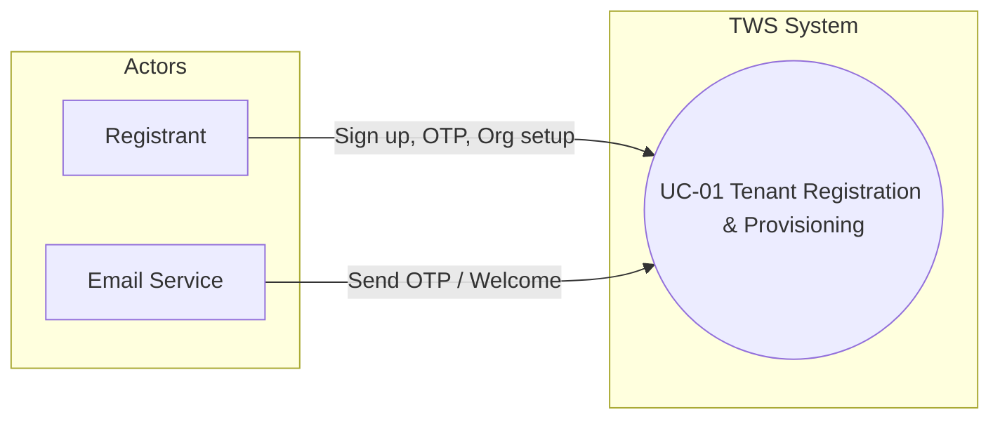

### UC-02 User Authentication & Login

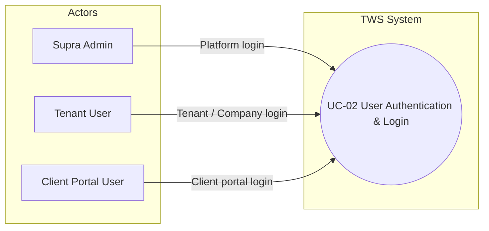

### UC-03 Software House Module Access

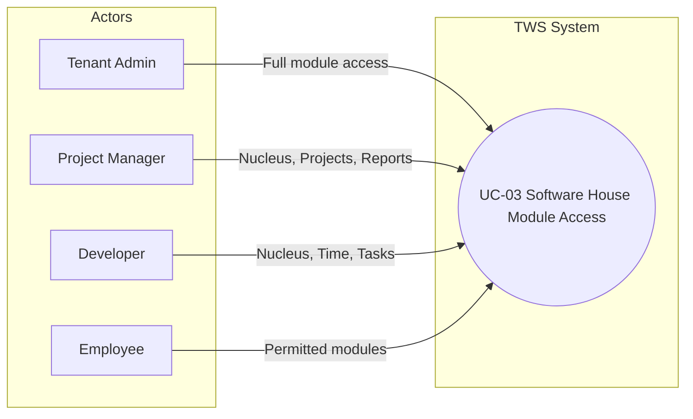

### UC-04 Nucleus Project Management

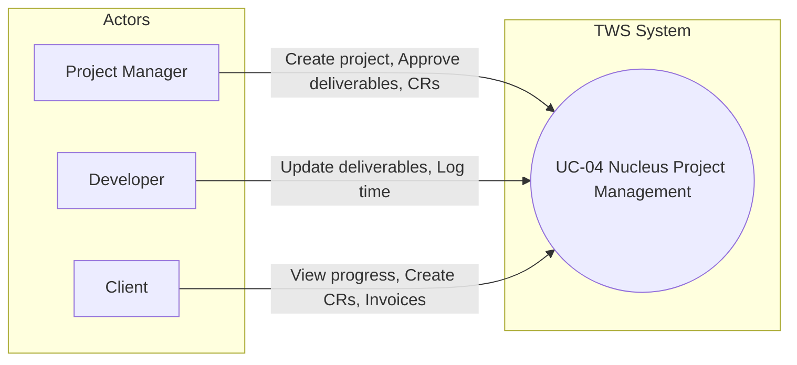

### UC-05 Department Management & Access

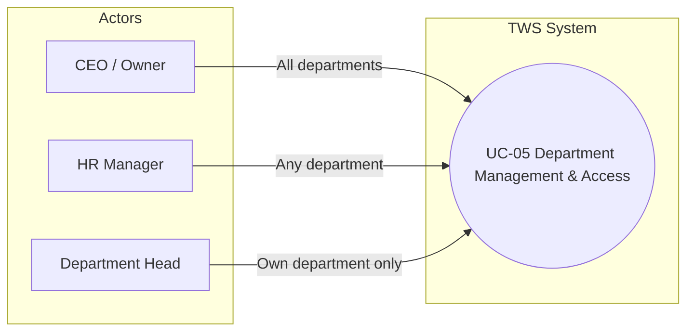

### UC-06 Supra Admin Operations

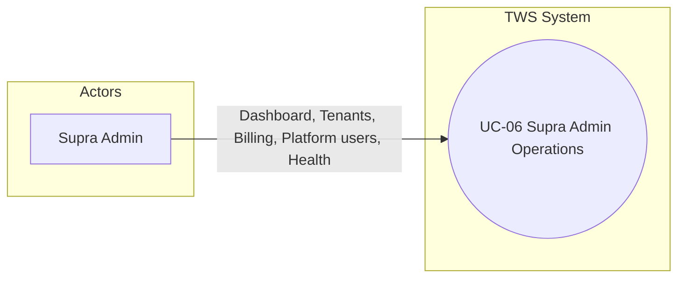

### UC-07 Dashboard & Analytics

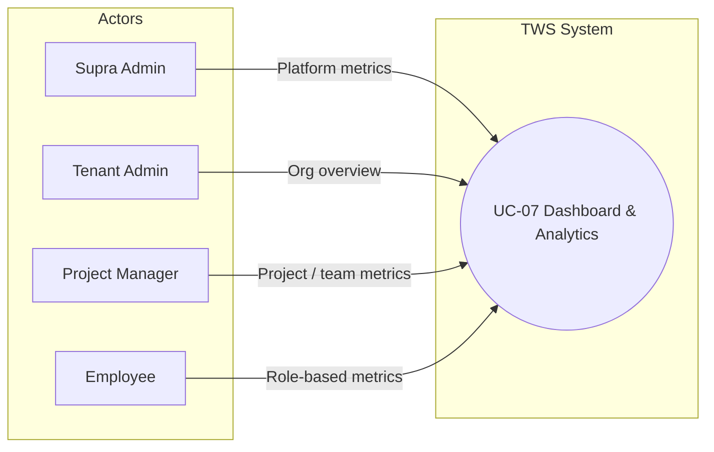

### UC-08 Reporting & Export

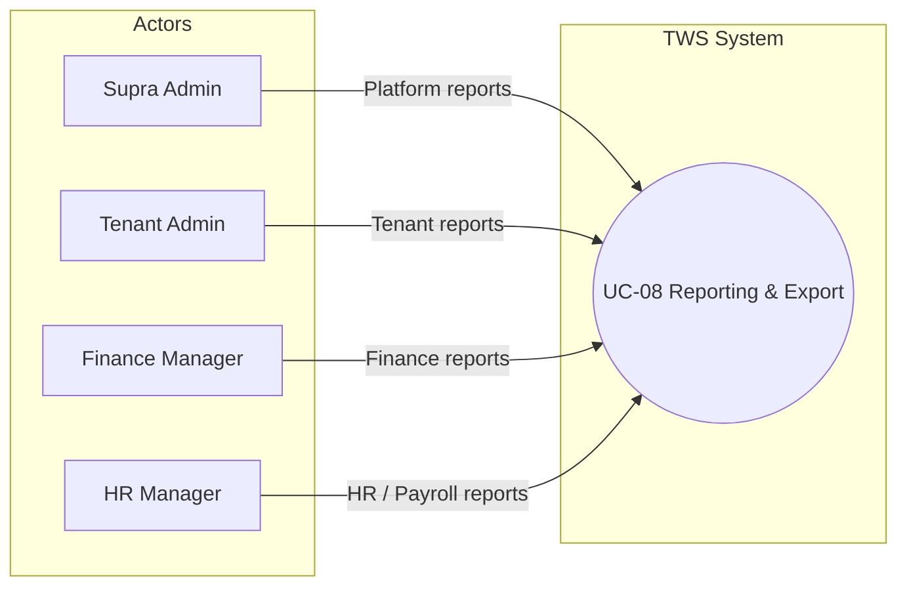

### UC-09 Notifications

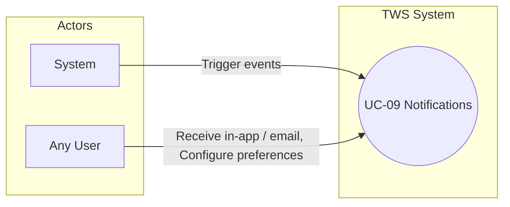

### UC-10 File Management

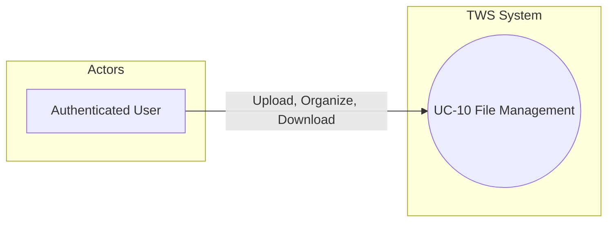

### UC-11 Subscription & Billing

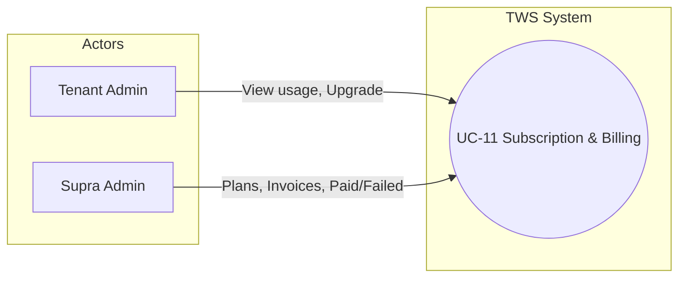

### UC-12 Tenant Audit Log Access

```mermaid
flowchart LR
  subgraph Actors
    CEO[CEO / Owner]
    DH[Department Head]
  end
  subgraph TWS["TWS System"]
    UC12(("UC-12 Tenant Audit Log Access"))
  end
  CEO -->|View, Export audit| UC12
  DH -->|View, Export (scope per role)| UC12
```

### UC-13 Profile Management

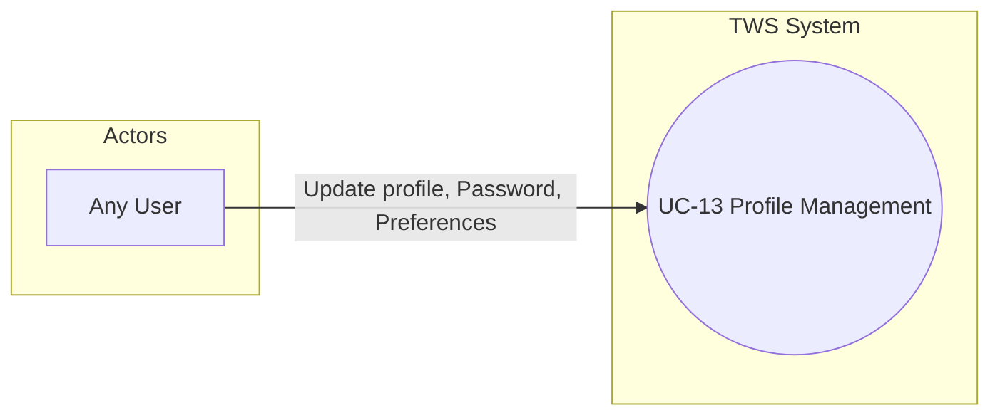

### UC-14 Document Hub

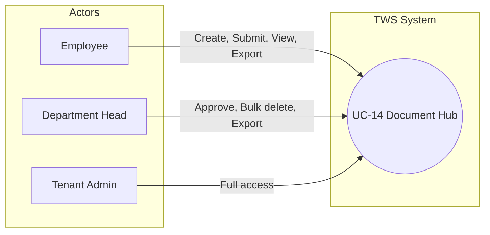

### UC-15 CRM & Deal Management

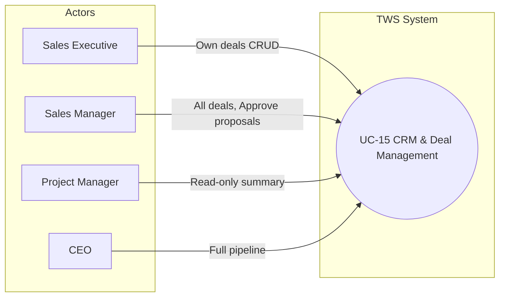

---

## 7. SECURITY REQUIREMENTS

### 7.1 Authentication & Authorization

- **Secure Authentication**: JWT-based authentication with token expiration
- **Password Security**: bcrypt hashing with minimum 10 rounds
- **Session Management**: Refresh token mechanism with 7-day expiration
- **Role-Based Access Control**: Granular permissions at API and UI levels

**Rate limits (authoritative):**

| Endpoint / area | Limit | Notes |
|-----------------|-------|--------|
| Authentication (login) | 5 per 15 min | Existing |
| Signup | 3 per hour | Existing |
| General API | 100 per 15 min | Existing |
| Department access grant/revoke APIs | 60 per 15 min | Bulk onboarding (e.g. 20 employees × 3 departments = 60 in one window) |
| Client portal APIs | 100 per 15 min | |
| Export/download (by role) | See table below | Role-based |

When rate limit is exceeded: respond with HTTP 429 and `Retry-After` header; client must not retry before Retry-After.

**Mobile restriction (NFR3):** Mobile restriction is enforced at **route middleware** only, not at token generation. departmentIds and role are always included in the token regardless of platform. Each restricted route checks X-Client-Platform; if 'mobile', return 403 with `{ code: 'DESKTOP_ONLY' }`. This allows the same user to switch to desktop without re-login.

**Export rate limits by role:**

| Role | Limit per 15 min |
|------|------------------|
| Regular employee | 10 |
| Manager/Team Lead | 30 |
| Department Head | 50 |
| HR Manager (payroll exports) | 100 |
| CEO/Admin | 200 |
| Bulk export (e.g. all employees at once) | 1 per 15 min, max 500 records per request |

### 7.2 Data Security

- **Data Encryption**: HTTPS/TLS for data in transit
- **Tenant Isolation**: Complete data isolation using tenantId/orgId filtering
- **Input Validation**: All user inputs validated and sanitized
- **SQL Injection Prevention**: Parameterized queries with Mongoose
- **XSS Prevention**: Content sanitization
- **CSRF Protection**: CSRF tokens for state-changing operations
- **TLS Verification**: Required for data in transit; HIPAA-specific verification when Healthcare module is added (future scope)

### 7.3 Application Security

- **Rate Limiting**: Per-endpoint rate limiting
- **Request Size Limits**: 5MB for JSON, 100MB for file uploads
- **File Upload Security**: File type validation, size limits, virus scanning (optional)
- **API Security**: Helmet.js security headers, CORS configuration
- **Error Handling**: Secure error messages without exposing system details

### 7.4 Audit & Compliance

- **Audit Logging**: All critical operations logged
- **Security Monitoring**: Failed login tracking, suspicious activity detection
- **Compliance**: GDPR (for EU clients), SOX (finance module). FERPA and HIPAA: future scope only — not applicable to Software House ERP.
- **Data Retention**: Configurable data retention policies
- **Right to Deletion**: GDPR-compliant data deletion

### 7.5 JWT token payload (authoritative)

All modules must use these claims; no ad-hoc claims without SRS update.

**Internal user token (ERP):** `userId`, `tenantId`, `orgId`, `role` (from TenantUser.primaryRole), `hrSubRole` (when role = 'hr'), `departmentIds` (from TenantDepartmentAccess), `platform: 'web' | 'mobile'`, `exp`, `iat`. Optionally `email`, `tenantSlug`.

**Client portal token:** `userId`, `tenantId`, `role: 'client'`, `clientId`, `projectIds[]`, `platform: 'portal'`, `exp`, `iat`.

**Revocation and security (implementation spec):** Token carries `departmentIds` for performance. For immediate effect the system SHALL use a revocation list. **Storage:** Redis (mandatory). **Key:** `revoked:{tenantId}:{userId}`. **Value:** timestamp of revocation. **TTL:** max token TTL (15 min) + 1 minute buffer; entry auto-expires. **Modules that MUST check revocation on every request:** Payroll (`/payroll/*`), Audit (`/audit/*`), Department access (`/department-access/*`), Finance reports (`/finance/reports/*`), HR salary data (e.g. `/employees/*/salary`), Export endpoints (any `/export`). **Modules that check on token validation only:** Task management, time tracking, notifications read, dashboard. **Revocation triggered by:** TenantUser.status → inactive (offboarding); TenantDepartmentAccess → revoked; emergency offboarding (FR12); tenant suspension (FR20). If user is on revocation list, return 403 even if token is valid.

### 7.6 Refresh token flow

- **Endpoint:** POST `/api/auth/refresh-token`. Input: refreshToken (httpOnly cookie or body).
- **Process:** (1) Validate refresh token (not expired, exists in DB). (2) Check userId on revocation list → if yes: 401 "Session revoked". (3) Check tenant active → if suspended: 403 "Account suspended". (4) Reload TenantUser and TenantDepartmentAccess; generate new access token (15 min). (5) Rotate refresh token (invalidate old, issue new 7-day). (6) Return new access token.
- **Security:** Refresh token rotation. If old refresh token is used after rotation: invalidate all refresh tokens for that user; force re-login; log in platform audit.

### 7.7 Unified Permission Resolution (UPR)

The system implements a **Unified Permission Resolution** layer so that tenant ERP access is enforced from a single source of truth. See **docs/UNIFIED_ACCESS_AND_ROLE_SYSTEM_PLAN.md** for full architecture.

**Implemented components:**

- **Permission resolver:** Resolves a user’s effective permissions from TenantUser.primaryRole, hrSubRole, TenantDepartmentAccess, and (where applicable) ProjectMember. Results are cached; cache is invalidated on grant/revoke/expiry, offboarding, and role changes.
- **GET /me/permissions:** Tenant endpoint `GET /api/tenant/:tenantSlug/organization/me/permissions` returns resolved modules (read/write per module), departmentIds, hrSubRole, projectIds, and projectDepartmentConfigs. The frontend uses this for menu visibility and sub-action gating (e.g. payroll export requires payroll:write).
- **requireErpAccess middleware (7-step pattern):** Protected tenant ERP routes use `requireErpAccess(options)` (module, action, checkRevocation, etc.). It enforces: tenant context, user active, revocation list (when checkRevocation), department access (when resource is department-scoped), resolved permission (or allowedRoles), project membership (when project-scoped), and optional tenant audit logging.
- **Routes using requireErpAccess:** Payroll, finance, attendance (main, integration, calendar, simple, software-house, admin attendance panel), employees, teams, tenant organization HR attendance and HR employees (`/hr/attendance`, `/hr/employees`), integration finance. Sensitive routes (payroll, finance reports, department access) use checkRevocation where specified in §7.5.
- **Department and project visibility:** Project list is filtered by user’s departments and ProjectMember membership; single-project API applies projectDepartmentConfigs (per-department view/action config). Department Visibility tab in project settings allows admins to set per-department presets. Department.moduleKey (enum) links departments to modules for menu and access.

**Relationship to §7.5:** Revocation list and modules that must check revocation are unchanged. UPR’s requireErpAccess is the enforcement point for those checks on the listed modules.

---

## 8. PERFORMANCE REQUIREMENTS

### 8.1 Response Time

- **API Endpoints**: 500ms for standard operations (95th percentile); see breakdown below for non-standard operations
- **Dashboard Load**: 2-3 seconds for initial load
- **Database Queries**: 500ms for 99% of queries
- **Real-Time Updates**: Less than 100ms latency

**Response time categories:**

| Operation type | Target |
|----------------|--------|
| Simple CRUD (single record) | &lt; 100 ms |
| List (paginated) | &lt; 200 ms |
| Dashboard aggregation | &lt; 500 ms |
| Complex reports | &lt; 2000 ms |
| Bulk/export/batch | &lt; 5000 ms |
| Real-time WebSocket | &lt; 100 ms |
| File upload acknowledgment | &lt; 300 ms |

### 8.2 Scalability

- **Concurrent Users**: Minimum concurrent users per tenant by plan — Trial/Starter: 25; Growth: 100; Professional: 500; Enterprise: unlimited (horizontal scaling). Horizontal scaling via load balancer; see §5.2 Multi-Tenant Architecture and §5.1 Technical Stack. Concurrent user limits assume horizontal scaling for Professional/Enterprise. Single instance capacity and scaling trigger points may be defined in deployment/ops documentation.
- **Horizontal Scaling**: Stateless API design supports horizontal scaling
- **Database Scaling**: MongoDB sharding support
- **Caching**: Redis caching for frequently accessed data

### 8.3 Resource Requirements

**Server (Recommended):**
- CPU: 4+ cores
- RAM: 8GB+
- Storage: 100GB+ SSD
- Network: 1Gbps

**Database (Recommended):**
- CPU: 8+ cores
- RAM: 16GB+
- Storage: SSD-based, scalable

---

## 9. APPENDICES

### 9.1 Module Availability (Software House)

| Feature | Backend | Frontend | Overall |
|---------|---------|----------|---------|
| Dashboard | ✅ | ✅ | ✅ |
| Users | ✅ | ✅ | ✅ |
| Settings | ✅ | ✅ | ✅ |
| Reports | ✅ | ✅ | ✅ |
| HR | ✅ | ✅ | ✅ |
| Finance | ✅ | ✅ | ✅ |
| Projects | ✅ | ✅ | ✅ |
| Nucleus PM | ✅ Complete | ✅ Complete (project workspace, deliverables, approvals, change requests, analytics) | ✅ |
| Deliverables | ✅ | ✅ (list, detail, create/edit, approval progress, date validation) | ✅ |
| Approvals | ✅ | ✅ (approval queue: pending list, approve/reject) | ✅ |
| Change Requests | ✅ | ✅ (dashboard list, detail page, acknowledge, evaluate, accept/reject) | ✅ |
| Analytics UI | ✅ | ✅ (Nucleus analytics: at-risk deliverables, status summary, project filter) | ✅ |
| Document Hub (FR26) | ✅ | ⚠️ | In progress |
| Department Management (FR27) | ✅ | ⚠️ | UPR implemented (see §7.7); requireErpAccess on department-access, payroll, finance, attendance, employees, teams, tenant org HR; menu uses GET /me/permissions; Department Visibility UI and projectDepartmentConfigs in place |
| Client Portal | ✅ | ✅ | ✅ |
| Notifications | ✅ | ⚠️ | In progress |
| Attendance | ✅ | ✅ | ✅ |
| Payroll | ✅ | ✅ | ✅ |
| CRM/Clients | ✅ | ✅ | ✅ |
| Deals (FR29) | ❌ | ❌ | Not implemented |
| Time Tracking | ✅ | ✅ | ✅ |

**Note:** Only Software House ERP is implemented and active. CRM/Clients = client management; Deal pipeline and Won→Project flow are defined in FR29 (to be implemented). Access to routes is governed by authentication and RBAC; there is no ERP-category-based module access control.

**Implementation notes (granular, for QA):** **Notifications — Email:** Task assigned ✅ template done. Leave approved ✅. Invoice overdue ❌ not built. Budget 80% warning ❌ not built. Deliverable rejected ❌ not built. **User preferences:** Email on/off ✅ done. In-app on/off ❌ not built. Per event type ❌ not built. WhatsApp: Out of scope. **Department Management (FR27) Manage Access:** Grant access ✅. View access list ✅. Set expiry date ⚠️ UI exists, date picker partial. Revoke ✅. Suspend ❌ not built in frontend. **Document Hub (FR26):** Backend done. Library/editor partial. Approval workflow: backend done; frontend submit/approve UI partial. **Nucleus PM / Deliverables / Approvals / Change Requests / Analytics UI:** Backend and frontend complete. Tenant routes: `projects/deliverables`, `projects/approvals`, `projects/change-requests`, `projects/analytics`; menu items under Projects (Software House). **Deals (FR29):** To be implemented per FR29.

### 9.2 Technology Versions

- **Node.js**: 18.x
- **Express**: 4.18.x
- **React**: 18.x
- **MongoDB**: 7.x
- **Mongoose**: 7.5.x
- **JWT**: jsonwebtoken 9.x
- **Socket.IO**: 4.7.x

### 9.3 API Endpoint Summary

**Total API Endpoints**: 300+

- **Auth Module**: ~20 endpoints
- **Admin Module**: ~50 endpoints
- **Tenant Module**: ~80 endpoints (includes department-access, audit)
- **Business Module**: ~100 endpoints (sub-breakdown: HR/Employees ~20, Payroll ~10, Finance ~15, Projects/Tasks ~20, CRM/Clients ~15, Time Tracking ~10, Nucleus PM ~10)
- **Core Module**: ~30 endpoints
- **Integration Module**: ~20 endpoints

### 9.4 Database Collections

**Core Collections:**
- `tenants` - Tenant information
- `users` - User accounts
- `organizations` - Organization data
- `roles` - Role definitions
- `permissions` - Permission definitions

**Business Collections:**
- `employees` - Employee information
- `departments` - Department definitions
- `attendance` - Attendance records
- `payroll` - Payroll data
- `accounts` - Financial accounts
- `transactions` - Financial transactions
- `projects` - Project data
- `tasks` - Task data
- `clients` - Client information

**Software House Collections:**
- `workspaces` - Nucleus workspaces for project organization
- `deliverables` - Project deliverables with Gantt chart data
- `approvals` - Deliverable approval workflow records
- `change_requests` - Change request management
- `software_house_roles` - Software House specific roles
- `development_metrics` - Development team metrics
- `time_entries` - Time tracking records
- `documents` - Document Hub documents (created and uploaded)
- `document_folders` - Document Hub folder organization
- `document_tags` - Document Hub tags/labels
- `document_versions` - Document version history
- `document_audit_logs` - Document Hub audit trail
- `tenant_department_access` - Tenant-scoped department access (granted by tenant admins; optional expiry)
- `tenant_audit_logs` - Tenant-facing audit log (user, action, resourceType, timestamp, IP)
- `tenant_notifications` - Missed notifications (FR18); delivered on reconnect for unread (e.g. last 24 hours)
- `onboarding_progress` - Onboarding checklist and progress tracking (FR2)
- `deals` - CRM deal pipeline (FR29); name, clientId, value, status, assignedSalesPersonId, expectedCloseDate, lostReason

**Note:** Projects collection includes embedded `projectDepartmentConfigs` (per-department viewConfig and actionConfig) for multi-department project views. The revocation list is stored in Redis (key `revoked:{tenantId}:{userId}`), not as a MongoDB collection.

---

## 10. DOCUMENT CONTROL

| Version | Date | Author | Changes |
|---------|------|--------|---------|
| 2.0 | February 17, 2026 | TWS Development Team | Complete system state documentation based on current implementation |
| 2.1 (Rev 1) | Feb 24, 2026 10:00 | TWS Development Team | Added FR27 Department Management & Access (Software House ERP); Product Functions and definitions updated; API/Collections summary updated for department-access, audit, TenantDepartmentAccess, TenantAuditLog, projectDepartmentConfigs |
| 2.2 (Rev 2) | Feb 24, 2026 13:00 | TWS Development Team | Removed FR28; HR sub-role (hrSubRole) required; document control and implementation status clarified; FR12 offboarding process defined; trial upgrade user-cap enforcement; JWT revocation list; authoritative API paths; UC-02 JWT steps; FR26 access matrix; FR25 change request edge cases; NFR3 mobile REDIRECT; onboarding steps; plan limits table; audit retention; NFR4 maintenance; export rate limits by role; ProjectDepartmentConfig preset; FR24 guest elevation API; Socket.IO scope; suspension flow; regulatory and inactive-route scope; FR3 roles scope |
| 2.3 | Feb 24, 2026 16:00 | TWS Development Team | SRS v2.3 remediation: §5.4 authoritative API paths (all modules); FR20 plan limits authoritative + storage measurement; §7.5 Redis revocation spec; UC-02 step 7d removed, §7.1 mobile route-only; §9.1 CRM clarification (client-only); FR12 emergency offboarding task reassignment; FR21 archive definition; §9.1 granular implementation notes; NFR2 HIPAA future scope; FR20 suspension warning by type; FR25 max resubmission policy; §7.6 refresh token flow; FR26 document approval notifications and timeout; §9.4 tenant_notifications, onboarding_progress, Redis note; UC-05 Department Access; UC-03/UC-04 department-aware flows; §7.1 department rate limit 60; §8.2/NFR1 concurrent-user note; §9.3 Business sub-breakdown; §1.1 and §10 dates |
| 2.4 | Feb 24, 2026 19:00 | TWS Development Team | Out-of-context cleanup: §7.4 FERPA/HIPAA future scope only; removed POS from §1.4; FR3/UC-02 education/healthcare roles and Education Login removed; opening note scoped (active/future/not in scope); FR24 Workspace = Nucleus container, card/list sub-features; §2.5 PCI-DSS future-only; §2.3 added Software House roles (Sales, HR, Finance, QA, Designer, DevOps, External Auditor); NFR3 accessibility phased (WCAG AA conditional), English-only language; NFR5/NFR7 phased (sharding, replication, RTO); FR22 Google Calendar optional Phase 4; §2.1/§5.1 monitoring phased (Prometheus/Grafana Phase 3+); removed Firebase Admin |
| 2.5 | Feb 24, 2026 22:00 | TWS Development Team | v2.4 expert review: §1.4 FERPA/HIPAA/PCI-DSS future-only note, SOX active; §1.2 duplicate Software House bullet merged, multi-language aligned with NFR3; §9.1 implementation notes filled (email templates, Manage Access, Document Hub); FR18 notification trigger matrix in SRS; FR29 CRM/Deal Management added; §9.4 deals collection; §2.4 Redis required for revocation; §8.2 self-reference fixed; §2.2 FR5→FR25; UC-05 access level, bulk grant, Dept Head scope, expiry; §10 version timestamps; stale v2.1 implementation note replaced with "see §9.1" |
| 2.6 | Feb 24, 2026 | TWS Development Team | §7.7 Unified Permission Resolution (UPR) added; FR27 updated with full list of routes using requireErpAccess; §9.1 Department Management (FR27) implementation note updated to reflect UPR and GET /me/permissions |
| 2.7 | Feb 24, 2026 | TWS Development Team | §9.1 Nucleus PM, Deliverables, Approvals, Change Requests, Analytics UI set to complete (frontend verified: tenant routes and pages exist); FR6/FR25 and implementation notes updated accordingly |
| 2.8 | March 2, 2026 | TWS Development Team | §11 System Diagrams (ERD, DFD, tenant subscription state machine) added; version/date headers and last-updated metadata updated. |
| 2.9 | March 3, 2026 | TWS Development Team | §6.0 Use Case–FR mapping and scope alignment added; gap analysis; UC-06 through UC-15 added (Supra Admin, Dashboard, Reporting, Notifications, File, Billing, Audit, Profile, Document Hub, CRM/Deals); §6.1 Mermaid use case diagrams for all 15 use cases. |

**Current implementation status:** See §9.1 Module Availability for up-to-date status of all modules.

---

**Status:** ✅ **CURRENT SYSTEM STATE DOCUMENTATION**

**Last Updated:** March 3, 2026

**Document Owner:** TWS Development Team

## 11. SYSTEM DIAGRAMS

This section provides three complementary diagrams for the TWS Multi-Tenant ERP Platform, aligning with the data model in §9.4, the architecture in §5, and functional requirements in §3:
- **Entity–Relationship Diagram (ERD)** — core entities and relationships across tenants, organizations, projects, and documents.
- **Data Flow Diagram (DFD)** — high-level data flows between user roles, the TWS application, and data stores.
- **State Transition Diagram** — tenant subscription and access lifecycle derived from FR20.

### 11.1 Entity–Relationship Diagram (ERD)

The ERD focuses on the core multi-tenant data model and how Software House ERP entities relate to each other. It summarizes the main MongoDB collections from §9.4 into logical entities:

- **Tenancy & identity:** `tenants`, `organizations`, `users`, `tenant_department_access`, `tenant_audit_logs`, `onboarding_progress`.
- **Business entities:** `employees`, `departments`, `projects`, `tasks`, `clients`, `time_entries`, `workspaces`.
- **Nucleus PM (Software House ERP):** `deliverables`, `approvals`, `change_requests`, `time_entries`.
- **Document Hub:** `documents`, `document_folders`, `document_tags`, `document_versions`, `document_audit_logs`.

At a high level:
- Each **Tenant** owns many **Organizations**, **Users**, **Departments**, **Workspaces**, **Clients**, **Projects**, and **Documents**.
- Each **Organization** employs many **Employees** and runs many **Projects** and **Clients**.
- **Projects** contain many **Tasks**, **Deliverables**, **ChangeRequests**, and **TimeEntries**.
- **Departments** and **Users** are linked via **TenantDepartmentAccess** (many-to-many) for department-scoped visibility (FR27, §7.7).
- The **Document Hub** entities are scoped per tenant/organization and, where applicable, departments.

The following Mermaid ER diagram summarizes these relationships:

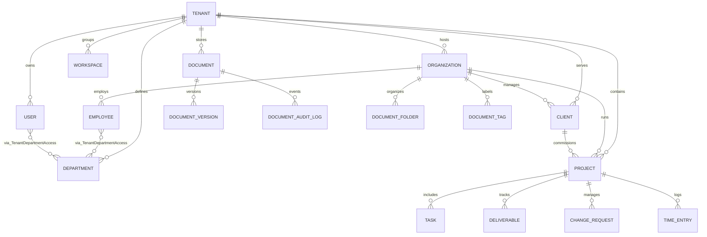

**Reference:** See §9.4 **Database Collections** and FR1, FR6, FR14, FR25, FR26, and FR27 for detailed requirements behind these relationships.

### 11.2 Data Flow Diagram (DFD)

This high-level (Level-0) data flow diagram shows how key user roles interact with the TWS application, and how the system reads/writes data to underlying stores and external services. It is consistent with §2.1 Product Perspective and §5 System Architecture.

- **External entities:** SupraAdmin, TenantAdmin/Owner, Employee, Client (portal), EmailService.
- **Core processes:** Authentication (FR3, §7.1–§7.6), Tenant signup & provisioning (FR2, FR4, UC-01), Nucleus PM & ERP operations (FR6, FR12–FR14, FR25–FR27), Subscription & billing enforcement (FR20).
- **Data stores:** MongoDB (all collections in §9.4), Redis (revocation list per §7.5), S3 Storage (files per FR19, FR26).

The following Mermaid flowchart approximates the DFD:

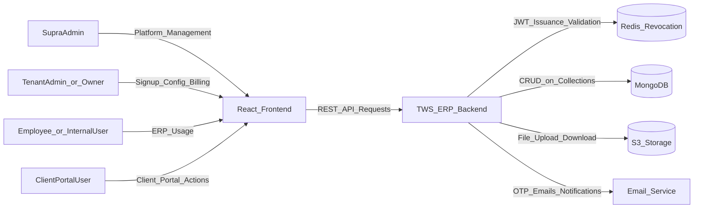

**Reference:** See §2 **Overall System Description**, §5 **System Architecture**, FR2–FR6, FR18–FR22, FR24–FR27, and §7 for security and token flows that govern these data movements.

### 11.3 State Transition Diagram (Tenant Subscription & Access)

This state machine models the lifecycle of a tenant’s subscription and access level, based on FR20 **Subscription & Billing Management** and related suspension/read-only rules:

- **Trialing:** New Software House tenants on a trial plan with Starter limits.
- **Active:** Paid or in-trial tenants with full write access (subject to plan limits).
- **PastDue:** Payment has failed, and the grace period countdown has started.
- **ReadOnly:** Tenant is in read-only mode (trial expired or grace period ended); write operations return 403 and UI redirects to billing.
- **Suspended:** SupraAdmin has manually suspended the tenant (immediate lockout).
- **Cancelled:** Tenant has been terminated; data export/retention rules apply.

Transitions are triggered by events such as trial expiry, payment failure, grace period expiry, invoice payment, manual suspension, and tenant-initiated cancellation.

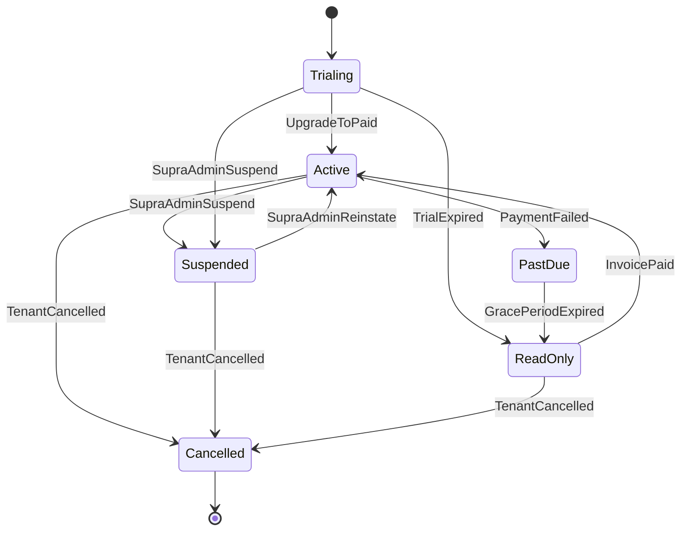

**Reference:** See FR20 for authoritative definitions of plans, statuses, read-only behaviour, grace periods, and suspension rules; and §7.5–§7.7 for how middleware enforces read-only and revocation at API level.

---

**END OF SOFTWARE REQUIREMENTS SPECIFICATION**
